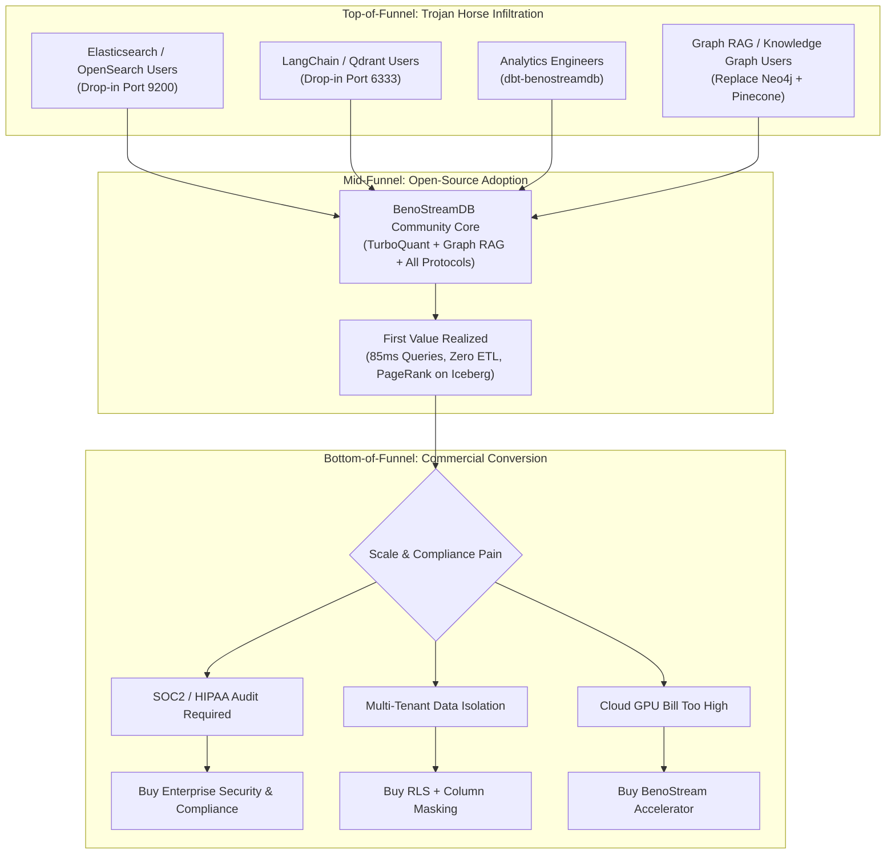

# BenoStreamDB: Commercialization, Monetization & Go-To-Market (GTM) Strategy

**Document Status:** Executive Architecture & Business Plan  
**Version:** 2.0 (Market-Validated)  
**Target Horizon:** 2026–2027  
**Author:** Antigravity / Engineering & Product Steering  
**Last Updated:** 2026-09-08  

---

## 1. Executive Summary & Market Dislocation

The modern data and AI infrastructure stack is suffering from severe architectural fragmentation and cost inflation:

1. **The Vector Database Silo Tax**: Dedicated vector databases (Pinecone, Milvus, Qdrant, Weaviate) require copying massive volumes of text and embeddings out of object storage into dedicated, always-on compute clusters with expensive RAM and NVMe SSDs ($5,000 – $50,000+/month).
2. **The Lakehouse Scan Tax**: Open data lake formats (Apache Iceberg, Delta Lake) excel at batch analytics but lack secondary index structures. Point lookups, high-selectivity filtering, and vector similarity queries require costly multi-gigabyte Parquet table scans.
3. **The Elasticsearch / OpenSearch Sprawl**: Organizations maintain brittle, JVM-heavy Elasticsearch clusters alongside their data lake just to achieve sub-second text and keyword filtering.

```
┌─────────────────────────────────────────────────────────────────────────┐
│                    THE ARCHITECTURAL DISLOCATION                        │
├───────────────────────────────────┬─────────────────────────────────────┤
│  TRADITIONAL SILOED APPROACH      │     BENOSTREAMDB APPROACH           │
├───────────────────────────────────┼─────────────────────────────────────┤
│ • Primary Data: S3 Iceberg Tables │ • Single Source of Truth: S3/GCS/Az │
│ • Vector Silo: Pinecone / Qdrant  │ • Persistent Sidecars: HNSW + BM25  │
│ • Search Silo: Elasticsearch 7.10 │ • Multi-Protocol Gateway: In-place  │
│ • ETL Pipelines: Airflow / Kafka  │ • Zero Data Duplication             │
│ • Massive Monthly Cloud Invoices  │ • 10x Compute & Storage Cost Cut    │
└───────────────────────────────────┴─────────────────────────────────────┘
```

**BenoStreamDB's Positioning:**  
*BenoStreamDB is the serverless, index-streaming database engine with persistent sidecar indexing for Apache Iceberg.* It brings the speed of in-memory vector databases and the text search of Elasticsearch directly to object storage without creating secondary data silos.

---

## 2. Core Moat & Defensibility

BenoStreamDB possesses three compounding structural advantages:

1. **Zero Data Duplication (Sidecar Architecture)**:  
   Index files (`.idx` Roaring Bitmaps, `.inv.parquet` string inverted indexes, `.hnsw` vector graphs) live directly alongside Parquet data in S3/GCS. Query engines prune partitions and segments before reading a single Parquet split.
2. **Multi-Protocol Gateway Ecosystem**:  
   - **Arrow Flight SQL Gateway (`benostreamdb-flight`)**: Zero-copy Arrow streaming for ADBC, JDBC, ODBC, and BI tools.
   - **Dual Search Gateway (`benostreamdb-search`)**: Drop-in OpenSearch / Elasticsearch 7.10 REST (Port 9200) and Qdrant REST (Port 6333).
   - **Official dbt Adapter (`dbt-benostreamdb`)**: Native vector distance macros and partition-looping incremental materializations.
   - **Spark & Trino Connectors (`spark-benostream`, `trino-benostream`)**: JNI FFI bridges with native GPU pushdown.
3. **Cloud-Agnostic Concurrency (`FileBasedLock`)**:  
   Zero vendor lock-in. Concurrency is handled uniformly via atomic object store CAS (`PutMode::Create`) with heartbeats and leases, running seamlessly across AWS S3, Google Cloud Storage, Azure Blob, and MinIO.

---

## 2.1 Product Hierarchy: BenoStreamDB as the Scalable Flagship

A foundational strategic principle governs the commercialization plan: **BenoStreamDB is the primary, scalable commercial asset.**

```
┌─────────────────────────────────────────────────────────────────────────────┐
│                   BENOSTREAMDB (Horizontal Data Infrastructure)             │
│  • Primary Product & Commercial Focus ($30B+ TAM across all industries)     │
│  • Apache Iceberg V2/V3 + RoaringBitmap + HNSW/TQ8 Overlays                 │
│  • Multi-Protocol Gateways: OpenSearch DSL, Qdrant wire, Arrow Flight SQL   │
└──────────────────────────────────────┬──────────────────────────────────────┘
                                       │ Real-World Scale Lab
                                       ▼
┌──────────────────────────────────────────────────────────────────────────────┐
│                 EDGARSTREAMDB (Internal Scale Lab & Showcase)                │
│  • Dogfooding proving ground: 10+ years of SEC EDGAR (Form 4, 10-K/Q)        │
│  • Demonstrates hybrid vector + high-cardinality pre-filtering under 4GB RAM │
│  • Powers PhD dissertation (Carhart + Insider Sentiment Factor ISF)          │
│  • Opportunistic Revenue: Packaged data appliance for quants ($500–$1.5k/mo) │
└──────────────────────────────────────┬───────────────────────────────────────┘
                                       │ Downstream UI
                                       ▼
┌─────────────────────────────────────────────────────────────────────────────┐
│                     OPENEDGAR (github.com/rla3rd/openedgar)                 │
│  • Independent Open-Source Application & Financial Intelligence Terminal    │
│  • Built on Wagtail (Python / Django) for clean admin, CMS, and analyst UI  │
│  • Connects directly to EdgarStreamDB via Arrow Flight & Python SDK         │
│  • Showcases live Graph RAG, interactive filing search & insider analytics  │
└─────────────────────────────────────────────────────────────────────────────┘
```

### The OpenEDGAR Application Architecture (Wagtail / Python)
* **Wagtail (Python / Django) Frontend**: OpenEDGAR is built on Wagtail, giving it an elegant, Python-native web framework, robust user/role management, and a content architecture that integrates seamlessly with Python data science libraries (PyArrow, Polars, Pandas).
* **Direct Lakehouse Connectivity**: Wagtail views query EdgarStreamDB / BenoStreamDB directly via **Arrow Flight (Port 50051)** for high-throughput zero-copy tabular streaming, or via the **REST search gateway (Port 9200)** for sub-second hybrid semantic queries.
* **Independent Commercial Vehicle**: OpenEDGAR serves as a completely standalone product and open-source demonstration vehicle—proving how a modern Python/Wagtail financial terminal can run 10+ years of EDGAR data with zero legacy database bloat.

### 2.1.0 Strategic Thesis: BenoStreamDB is Where the Real Money at Scale Lives (Not EDGAR)

> [!IMPORTANT]
> **The Real Scale & Enterprise Valuation Moat**:
> EDGAR data products (like InsiderScore, Sentieo, or BamSEC) are fundamentally **vertical niche applications** with an addressable market capped at hedge funds, RIA desks, and quant funds (~$50M–$100M total addressable market). They carry heavy customer acquisition friction, high churn during market downturns, and trade at modest **3x–6x ARR valuation multiples**.
> 
> In contrast, **BenoStreamDB is horizontal data infrastructure addressing a $30B+ TAM**. Database and search infrastructure companies (Snowflake, Databricks, Elastic, MongoDB, ClickHouse) capture multi-billion-dollar enterprise valuations trading at **15x–30x+ ARR multiples**. Every enterprise running data lakes on AWS S3, Google Cloud, or Azure—across cybersecurity, e-commerce, healthcare, ad-tech, and AI software—is a target customer.
> 
> **EdgarStreamDB is not the end goal; it is the ultimate "Lighthouse" proving ground.** By proving that BenoStreamDB can ingest, index, and query 12+ years of the most irregular, high-cardinality, multi-vector disclosure data in the world under a 4 GB RAM ceiling for $45/mo on S3, we create the definitive enterprise benchmark that sells BenoStreamDB to Fortune 500 data platform architects.

### Why Infrastructure is Exponentially More Scalable than a Vertical App
1. **Total Addressable Market (TAM)**: Vertical financial tools cap out at hedge funds and quant desks (~$50M TAM) with long institutional sales cycles and heavy maintenance burdens (shifting SEC XBRL taxonomies). BenoStreamDB addresses any enterprise using S3, Iceberg, or vector search across healthcare, cybersecurity, retail, and tech ($30B+ TAM).
2. **Engineering Leverage**: Building features into BenoStreamDB builds compounding equity in the database engine. EdgarStreamDB exists to battle-test BenoStreamDB under brutal real-world data skew.
3. **Authentic Marketing Credibility**: When enterprise evaluators ask *"Has this handled messy real-world scale?"*, the answer is: *"Yes. We run 10+ years of full SEC EDGAR disclosures on a single 4 GB node using BenoStreamDB."*
4. **Opportunistic Cash Flow**: If financial customers buy EdgarStreamDB appliances or OpenEDGAR subscriptions, that revenue serves as non-dilutive bootstrapping capital, while enterprise value accrues to BenoStreamDB.

---

### 2.1.1 Case Study: The InsiderScore / VerityData (TMX Group) Teardown & Operating Leverage

A compelling real-world benchmark for the commercial potential and M&A valuation precedent of specialized SEC filing intelligence is **InsiderScore** (merged into **VerityData**, which was acquired by **TMX Group** in Canada, operator of the Toronto Stock Exchange and TMX Datalinx):

* **Corporate Rollup & Strategic M&A Precedent**: The acquisition of VerityData by **TMX Group** proves that proprietary, structured SEC filing and corporate insider intelligence represents an elite, high-value asset class coveted by global financial exchanges seeking to expand recurring high-margin data revenue (TMX Datalinx).
* **The Incumbent Scale**: As an operating business, InsiderScore / VerityData generated approximately **~$20M/year in ARR with ~80 employees** (~$250k revenue per employee), serving hundreds of institutional asset managers, long/short equity hedge funds, and private equity firms.
* **The Institutional Pricing Reality**: Institutional hedge funds do not buy on $50/mo SaaS tiers; they pay **$25,000 to $75,000+ per firm per year** out of soft-dollar research budgets (Section 28(e)) because detecting a single opportunistic insider cluster buy or short-squeeze warning justifies the entire annual subscription.
* **The Post-Acquisition Incumbent Vulnerability**:
  - **Exchange Conglomerate Inertia**: Under TMX Group ownership, VerityData faces the classic post-acquisition corporate dilemma: bureaucratic enterprise sales cycles, cross-product bundling pressures, slower iteration velocity, and corporate overhead.
  - **Legacy Technology Debt**: TMX/VerityData inherits a multi-decade relational database and manual analyst architecture with substantial fixed operational costs.
  - **Customer Price Fatigue**: Institutional desks routinely face price increases and rigid seat-licensing restrictions from exchange-owned data vendors, creating a prime opening for a modern, developer-friendly, open-core alternative.
* **The 12-Year Modern Horizon (2014–Present) + Free Tiingo BYOK Connector**:
  * **Free "Bring Your Own Key" (BYOK) Pricing Integration**: We never resell or redistribute proprietary Tiingo market data (which would require expensive exchange redistribution licenses). Instead, we provide the **free, open-source connector code** that allows users to plug in their own personal or institutional Tiingo subscription (`TIINGO_API_KEY`). The engine downloads split/dividend-adjusted historical prices (`adjClose`, `adjVolume`) directly into their local Iceberg lakehouse and calculates forward alpha attribution (30-day, 90-day, and 180-day post-trade excess returns vs SPY) for every corporate insider and director in the United States.
  * **100% Universal XBRL Standardization**: While Form 4 XML began in 2004, the SEC's interactive XBRL mandate for 10-K and 10-Q financial statements was only universally completed across all filers by 2013–2014. Starting from 2014 ensures zero missing XBRL taxonomies or broken historical gaps.
  * **Quant-Standard 12-Year Multi-Regime Backtest**: 2014–2026 spans over 140 monthly cross-sectional periods across 4 distinct volatility environments (the 2015–2016 commodity slump, the 2018 tightening cycle, the 2020 COVID shock, and the 2022–2026 rate/inflation regime)—meeting the 10+ year lookback standard required by institutional hedge funds.
  * **The Sub-2 TB S3 Footprint**: Columnar Parquet compression and TurboQuant TQ8 compress the entire 2014–2026 corpus down to **under 2 TB on AWS S3**, costing **less than $45/month in storage** while enabling rapid backfills and sub-50ms hybrid queries. (The 2004–2013 corpus remains an optional deep historical extension).

#### Where Their Underlying Costs Lie (And How We Mitigate 90% of Them)

| Operational Layer | InsiderScore / VerityData (Legacy Incumbent) | EdgarStreamDB (BenoStreamDB + AI) | **Cost & Margin Advantage** |
| :--- | :--- | :--- | :--- |
| **Data Tagging & Ingestion** | Army of 40+ manual data analysts (domestic/offshore) reading Form 4 footnotes and classifying 10b5-1 plans vs open-market trades. | **Rust-native automated XML/XBRL parsers + LLM zero-shot classification**. Ingestion is instantaneous and automated. | **95% labor cost reduction**. Zero human data entry bottleneck. |
| **Database & Search Infrastructure** | Multi-node relational databases (Oracle/SQL Server) + heavy Elasticsearch clusters with dedicated DBA overhead. | **Serverless Apache Iceberg on S3** with persistent RoaringBitmap + HNSW sidecars. Runs on a single 4 GB node. | **90% hosting savings**. Cloud bill drops from $30k+/mo to <$300/mo. |
| **Analytical Rigor & Alpha** | Heuristic historical track record scoring and simple keyword alerts. | **PhD-grade Insider Sentiment Factor ($\text{ISF}_t$)** augmenting Carhart (1997) 4-factor asset pricing via deep cross-attention models. | **Superior quantitative credibility** and verifiable statistical alpha. |
| **Entity & Network Graphs** | Tabular relational lookups. Hard to trace multi-board executive trading syndicates. | **Native Graph RAG & PageRank** executed directly across unified Iceberg tables. | **Deeper relational intelligence** with zero secondary graph databases (no Neo4j). |

#### The Solo-Founder Bootstrap Economics
* **The Traditional Playbook**: 80 employees, heavy payroll, real estate, and high SG&A eating most of the $20M revenue.
* **The Lean Modern Playbook**: A modern, AI-automated, Rust-powered engine can deliver a higher-fidelity, lower-latency data product with **1 to 3 people**.
* **The Commercial Math**: Capturing just **5% of InsiderScore’s market** (15 to 20 hedge funds at $30,000–$50,000/yr ACV) generates **$450,000 – $1,000,000 ARR with >95% gross margins**.
* **Strategic Role**: This high-margin cash flow can fully fund the solo founder's bootstrapping and doctoral completion—generating non-dilutive capital while proving BenoStreamDB's enterprise capabilities under real-world fire.

#### The Strategic Exit / OEM Leverage Vector: Potential TMX Synergies vs. Legal Firebreak
Once the data pipeline operates flawlessly in EdgarStreamDB—delivering clean Form 4 transaction aggregation, automated footnote parsing, and forward alpha metrics—**TMX Group (via TMX Datalinx / VerityData) represents a natural future consolidator or wholesale distributor**:
1. **Vertical Asset Carve-Out Sale ($10M–$30M Potential)**: TMX acquired VerityData to build out TMX Datalinx. By demonstrating a 100% automated Rust pipeline that eliminates 90% of Verity's analyst payroll and cloud hosting costs, TMX has an overwhelming operational incentive to acquire the EdgarStreamDB/OpenEDGAR technology.
2. **Founder Retains the Crown Jewels (BenoStreamDB)**: The acquisition is structured strictly as a vertical financial asset sale or domain license. The founder retains 100% ownership of the horizontal **BenoStreamDB engine**, utilizing the multi-million dollar cash exit to finance BenoStreamDB's global conquest of the $30B+ enterprise lakehouse market.
3. **Wholesale OEM Distribution via TMX Datalinx**: Alternatively, EdgarStreamDB supplies normalized, alpha-scored feeds directly to TMX Datalinx under a recurring $250k–$750k/year contract, tapping TMX's worldwide institutional sales reach with zero customer acquisition expense.

#### Legal Firebreak, Prior Inventions & Clean-Room Governance
To ensure that BenoStreamDB’s enterprise value is 100% unencumbered and protected against any legacy corporate disputes:
* **The Horizontal Infrastructure Shield**: BenoStreamDB is a general-purpose, horizontal database engine (Apache Iceberg, RoaringBitmaps, HNSW, Flight SQL). It is infrastructure software, entirely distinct from vertical equity research or insider tracking workflow applications.
* **Prior Inventions & Stat-Arb Carve-Out**: Quantitative data modeling, alpha attribution, and statistical arbitrage methods are ring-fenced under explicit prior invention carve-outs.
* **Non-Compete & Counterparty Caution**: Because Verity LLC is an operating subsidiary of TMX Group, **no premature commercial overtures or direct pitches will be made to TMX or former affiliates** until post-employment covenants (2-year restriction, multi-jurisdiction NJ/MA/FL) have cleanly lapsed and undergone independent legal clearance.
* **Strict Hardware Clean-Room Protocol**: 
  - All proprietary core engine development is executed on personal Linux workstations (`/home/ralbright/projects/benostreamdb`).
  - All Git commits are authored strictly under personal identity (`rla3rd <rla3rd@gmail.com>`).
  - Apple Silicon M-series Metal GPU acceleration is maintained strictly in the **Apache 2.0 Open Source Community Tier**, with local Mac testing transitioned to personal second-hand hardware to guarantee an airtight chain of custody.

---

## 2.2 The Competitive Landscape: Four Threat Vectors

BenoStreamDB competes across four distinct product categories in data infrastructure:

```
┌────────────────────────────────────────────────────────────────────────────────────────────────────────┐
│                                 THE VECTOR & SEARCH COMPETITIVE LANDSCAPE                              │
├────────────────────────┬────────────────────────────────┬──────────────────────────────────────────────┤
│ CATEGORY               │ KEY PLAYERS                    │ HOW BENOSTREAMDB WINS                       │
├────────────────────────┼────────────────────────────────┼──────────────────────────────────────────────┤
│ 1. Disk & Lakehouse-   │ • LanceDB                      │ Open Iceberg/Parquet standard vs. bespoke    │
│    Adjacent Engines    │ • Turbopuffer                  │ formats (.lance) or closed proprietary SaaS. │
├────────────────────────┼────────────────────────────────┼──────────────────────────────────────────────┤
│ 2. Dedicated "Pure-    │ • Pinecone, Qdrant,            │ Zero data silos: S3 sidecars vs. $5k–$50k/mo │
│    Play" Vector Silos  │   Milvus, Weaviate, Chroma     │ hot RAM/NVMe clusters; Qdrant wire drop-in.  │
├────────────────────────┼────────────────────────────────┼──────────────────────────────────────────────┤
│ 3. Search & Database   │ • Elasticsearch / OpenSearch   │ Scale-to-zero Rust serverless vs. JVM heap   │
│    Incumbents          │ • pgvector (PostgreSQL)        │ crashes; TB-scale per node vs. pg RAM limits.│
├────────────────────────┼────────────────────────────────┼──────────────────────────────────────────────┤
│ 4. Big Cloud           │ • Databricks Vector Search     │ Multi-cloud & format neutrality vs. locked-in│
│    Lakehouse Giants    │ • Snowflake Cortex Search      │ DBU consumption and proprietary credits.     │
└────────────────────────┴────────────────────────────────┴──────────────────────────────────────────────┘
```

### Threat Category Breakdown:

#### 1. Disk & Lakehouse-Adjacent Engines
* **Turbopuffer**: Proves that serverless vector search directly on AWS S3 and NVMe is fast and viable. However, Turbopuffer is a **closed-source proprietary SaaS** where customer data must leave their VPC, and it completely lacks Apache Iceberg, Trino, Spark, or dbt integration.
* **Vespa (Yahoo)**: Battle-tested hybrid search engine with deep tensor rankers, but requires brutal operational complexity, custom C++ schemas, and heavy multi-node cluster management.

#### 2. Dedicated "Pure-Play" Vector Silos
* **Pinecone**: The SaaS pioneer. Sells convenience at exorbitant cost ($5,000–$50,000+/month). Requires duplicate ETL pipelines to keep data synchronized from S3.
* **Qdrant & Milvus**: High-performance vector engines. Milvus is notoriously complex to deploy (requires Kafka/Pulsar, etcd, MinIO). Qdrant is an exceptional vector engine—which is why **BenoStreamDB emulates Qdrant's REST wire protocol on Port 6333**, allowing Qdrant users to migrate without modifying client code.
* **Chroma**: Excellent for local Python prototyping, but struggles with large-scale multi-node concurrency and enterprise governance.

#### 3. Search & Database Incumbents
* **Elasticsearch / OpenSearch**: The enterprise standard for keyword search. Added vector search, but requires massive JVM heaps (32GB+ RAM per node), suffers from GC pauses, and costs thousands per month in idle compute. **BenoStreamDB emulates Elasticsearch 7.10 on Port 9200**, eliminating the JVM overhead entirely.
* **pgvector (PostgreSQL)**: The default starting point for developers. Hits severe performance and cost walls above 5M–10M vectors due to RAM constraints and Write-Ahead Log (WAL) amplification during index builds.

#### 4. The Lakehouse Giants
* **Databricks Vector Search & Snowflake Cortex Search**: Offer vector search over their respective proprietary platforms (Delta Lake and Snowflake internal tables). They charge high consumption markup (DBUs and credits) and enforce strict platform lock-in.

---

## 2.2 Deep Teardown: BenoStreamDB vs. LanceDB ("The Format Trap")

LanceDB is our most visible mindshare competitor in the "serverless/embedded disk-native vector database" category. However, LanceDB made a critical architectural gamble that creates BenoStreamDB's sharpest enterprise wedge: **The Format Trap**.

```
┌─────────────────────────────────────────────────────────────────────────────┐
│                    LANCEDB vs. BENOSTREAMDB ARCHITECTURE                   │
├──────────────────────────────────────┬──────────────────────────────────────┤
│  LANCEDB: The Format Rewrite Trap    │  BENOSTREAMDB: Native Iceberg Standard│
├──────────────────────────────────────┼──────────────────────────────────────┤
│ • Custom file format (.lance)        │ • Standard: Apache Iceberg V2/V3     │
│ • Forces full data rewrite & ETL     │ • Zero data rewrite (Sidecar Overlay)│
│ • Black box to enterprise catalogs   │ • Governed by Glue, Polaris, Unity   │
│ • Custom Python/Node client bindings │ • Multi-Protocol: Flight SQL, dbt, ES│
│ • Separate silo from lakehouse stack │ • Reads alongside Parquet in-place   │
└──────────────────────────────────────┴──────────────────────────────────────┘
```

### Why BenoStreamDB Wins the Enterprise Battle against LanceDB:
1. **No Data Rewrites (The Sidecar Advantage)**:
   LanceDB requires companies to ingest their data into `.lance` files. For an enterprise with hundreds of terabytes in S3, migrating to `.lance` is an operational non-starter. BenoStreamDB leaves Parquet files untouched and simply generates persistent sidecar indexes (`.hnsw`, `.idx`, `.inv`) in the same object storage bucket. A single embedded node indexes and serves **TB-scale** corpora; larger datasets are handled by fanning the same sidecars out across a distributed query engine (Spark/Trino) rather than by one process.
2. **Respect for the Winning Standard (Iceberg)**:
   Enterprises spent billions standardizing on Apache Iceberg to prevent vendor lock-in. LanceDB is attempting to replace Parquet with `.lance`. BenoStreamDB embraces Iceberg V2/V3, supporting snapshot isolation, sort orders, partition evolution, and catalog integration.
3. **The Protocol Advantage**:
   LanceDB requires using their proprietary client SDKs. BenoStreamDB provides **zero-code-change drop-in emulation**:
   - Drop-in for **Elasticsearch 7.10 (Port 9200)** for document & BM25 search.
   - Drop-in for **Qdrant (Port 6333)** for unstructured vector payloads.
   - Drop-in for **Arrow Flight SQL (Port 50051)** for zero-copy analytical SQL.
   - Official **`dbt-benostreamdb` adapter** for pure SQL vector feature engineering.

**Our Core Marketing Counter to LanceDB:**  
> *"LanceDB asks you to rewrite your lakehouse into a new, unproven file format (`.lance`). BenoStreamDB keeps your data in 100% standard Apache Iceberg Parquet files and gives you 10x faster vector and text search using persistent sidecar indexes."*

---

## 2.3 The Master Competitive Moat Matrix

| Competitor | Their Angle | Why Customers Leave / Hesitate | BenoStreamDB's Winning Wedge |
| :--- | :--- | :--- | :--- |
| **LanceDB** | Embedded disk-native vector DB | Proprietary `.lance` format forces full data rewrites | **Native Iceberg V2/V3 + Parquet sidecars (zero rewrite)** |
| **Turbopuffer** | S3-native serverless vector API | Closed SaaS, data leaves VPC, no lakehouse integration | **Open-source / VPC deployable, native to Iceberg stack** |
| **Pinecone** | Managed vector pioneer | Ridiculous cost at scale, creates isolated data silos | **10x cheaper in-place S3 search without data movement** |
| **Qdrant** | Rust vector database | Vector-only silo, does not speak SQL or Iceberg | **Emulates Qdrant wire protocol (Port 6333) over Iceberg** |
| **Elasticsearch** | Enterprise search standard | JVM memory hog, complex clustering, high idle cost | **Emulates ES 7.10 (Port 9200) in Rust, scale-to-zero** |
| **pgvector** | Relational vector extension | Cannot index large data lakes without high RAM | **O(1) sidecars on object storage, TB-scale per node** |
| **Databricks** | Managed lakehouse search | High DBU credit pricing, proprietary Delta lock-in | **Vendor-neutral, multi-cloud Iceberg core** |

---

## 3. Market-Validated Feature Monetization Strategy

### 3.1 Feature Viability: Competitive Reality Check (September 2026)

Before defining the commercial package, we audited every proposed enterprise feature against what the competitive landscape ships for free. The results require a fundamentally different packaging strategy than a naive "gate everything" approach.

```
┌──────────────────────────────────────────────────────────────────────────────┐
│                    FEATURE VIABILITY MATRIX (SEPT 2026)                       │
├─────────────────────────────────┬─────────┬──────────────────────────────────┤
│ FEATURE                         │ VERDICT │ RATIONALE                        │
├─────────────────────────────────┼─────────┼──────────────────────────────────┤
│ Security / RLS / Column Masking │ 🟢 SELL │ Universally gated behind paid    │
│                                 │         │ tiers at Pinecone, Qdrant, Milvus│
├─────────────────────────────────┼─────────┼──────────────────────────────────┤
│ Cryptographic Audit Logging     │ 🟢 SELL │ Enterprise-only at every vendor; │
│                                 │         │ required for SOC2/HIPAA signoff  │
├─────────────────────────────────┼─────────┼──────────────────────────────────┤
│ Fused GPU / SIMD Kernels        │ 🟢 SELL │ Engineering effort moat; nobody  │
│                                 │         │ ships Iceberg-specific kernels   │
├─────────────────────────────────┼─────────┼──────────────────────────────────┤
│ Autopilot (Compaction Daemon)   │ 🟡 WEAK │ Basic compaction is free at      │
│                                 │         │ Qdrant, Milvus, Weaviate; must   │
│                                 │         │ differentiate on 3-format aware  │
├─────────────────────────────────┼─────────┼──────────────────────────────────┤
│ Streaming WAL (Sub-10ms)        │ 🟡 WEAK │ Architecturally incompatible w/  │
│                                 │         │ Iceberg commit model; redesign   │
├─────────────────────────────────┼─────────┼──────────────────────────────────┤
│ TurboQuant™ (TQ4/TQ8 Quant.)   │ 🔴 FREE │ FWHT+SQ is ICLR 2026 public     │
│                                 │         │ research; shipped free by Qdrant,│
│                                 │         │ Milvus, LanceDB, Elastic         │
├─────────────────────────────────┼─────────┼──────────────────────────────────┤
│ Catalog Mesh (Two-Way Sync)     │ 🔴 FREE │ Commoditized by Apache Polaris   │
│                                 │         │ (graduated Feb 2026) and Iceberg │
│                                 │         │ REST spec; Horizon ships it free │
└─────────────────────────────────┴─────────┴──────────────────────────────────┘
```

### 3.2 The Honest Monetization Principle

> *"We give away the best open-source Iceberg vector engine for free — including TurboQuant, all catalogs, and all protocols. We charge for the security, compliance, and operational automation that lets you run it in production at Fortune 500 scale."*

**Why this works:** The developer community has zero tolerance for paywalled algorithms that competitors ship for free. Gating TurboQuant or catalog support would make BenoStreamDB *less* competitive, not more. The features enterprises actually write six-figure checks for are security, compliance, and operational risk reduction — precisely where no open-source vector DB delivers.

---

## 3.3 Commercial Feature Details

### 🟢 Pillar 1: Enterprise Security & Compliance (PRIMARY REVENUE DRIVER)

This is the **#1 purchase trigger** in enterprise data infrastructure. Every major competitor (Pinecone, Qdrant, Milvus, Weaviate) gates security behind paid tiers. The market has validated this model.

#### Feature A: Sidecar-Level Row-Level Security (RLS) & Multi-Tenancy
* **What makes it unique**: Because BenoStreamDB queries hit sidecar indexes (`.idx`, `.hnsw`) *before* touching Parquet, tenant isolation is enforced at the **index scan layer** via bitmap intersection — not at the query result layer. No competitor does this.
* **Implementation**: Intersect tenant-scoped Roaring Bitmap filters directly in the sidecar index path, ensuring Parquet reads never even see rows outside the caller's tenant scope.
* **Target Buyer**: CISO / Enterprise Architect / VP of Data Platform.
* **Value Pitch**: *"Tenant isolation enforced before a single Parquet byte is read."*

#### Feature B: Dynamic Column Masking
* **What makes it unique**: No vector-first engine offers automatic PII redaction (SSN, credit cards, emails) based on caller identity/role on vector query results. PostgreSQL has masking via extensions, but no Iceberg or vector-native engine does.
* **Compliance alignment**: HIPAA Safe Harbor, GDPR Article 25 (Data Protection by Design).

#### Feature C: Customer-Managed Encryption Keys (CMEK)
* **Standard enterprise requirement**: Envelope encryption for sidecar indexes using AWS KMS, GCP Cloud KMS, or HashiCorp Vault.
* **Competitive validation**: Pinecone charges for this. Qdrant charges for this.

#### Feature D: Cryptographic Audit Logging & Lineage
* **What makes it unique**: Append-only, tamper-evident cryptographic hash chain recording every Flight SQL query, `_search` request, user identity, execution latency, and retrieved document/record IDs — across **all three protocols** (Port 9200, 6333, 50051). No competitor has multi-protocol audit because no competitor runs three protocols.
* **SIEM Export**: Native export to Splunk, Datadog, AWS CloudWatch, and Snowflake.
* **Cross-catalog governance propagation**: When sidecar indexes are registered across multiple catalogs (Polaris, Unity, Glue), RLS policies and audit events propagate consistently.
* **Target Buyer**: Compliance & Security Engineering / SOC2 Auditors.
* **Value Pitch**: *"Complete non-repudiation audit trails for AI and SQL data access. Pass your SOC2 Type II audit without building custom logging infrastructure."*

---

### 🟢 Pillar 2: BenoStream Accelerator (COST-REDUCTION SELL)

The value here is NOT the quantization algorithms (those are free). The value is **specialized systems engineering that cuts the customer's cloud bill in half** on the same workload.

#### Feature E: Fused SIMD & Tensor Core Kernels
* **What's monetized**: Hand-crafted AVX-512, ARM SVE, and NVIDIA Hopper/Blackwell FP8/FP4 fused tensor kernels optimized specifically for BenoStreamDB's sidecar distance computation patterns.
* **Why this has value**: Generic libraries (cuVS, faiss) don't understand BenoStreamDB's three-file format. Fused kernels that pipeline sidecar bitmap intersection → quantized distance → Parquet column fetch are 3–5x faster than calling generic library functions sequentially.
* **Target Buyer**: Head of AI / Chief Data Scientist / Cloud FinOps.
* **Value Pitch**: *"Run your 1 billion embedding workload on 2 nodes instead of 8."*

#### Feature F: GPUDirect Storage Bypass
* **What's monetized**: Bypasses host CPU memory entirely, streaming sidecar indexes directly from NVMe/S3 local cache into GPU VRAM via NVIDIA GDS.
* **Why this has value**: Eliminates the PCIe copy bottleneck that caps throughput for GPU-accelerated vector search. Nobody else in the Iceberg ecosystem offers this.

#### Feature G: Iceberg Sidecar Lifecycle Manager (Evolved Autopilot)
* **Why basic compaction is NOT monetizable**: Qdrant, Milvus, and Weaviate all ship automatic segment compaction for free. A simple "auto-compact" daemon is table stakes in 2026.
* **What IS monetizable**: BenoStreamDB uniquely manages **three file formats simultaneously** — Iceberg manifests, Parquet data files, and sidecar indexes (`.hnsw`, `.idx`, `.inv`). The Sidecar Lifecycle Manager provides:
  - **Three-format coordination**: Synchronized compaction of Parquet bin-packing, sidecar index merging, and Iceberg snapshot cleanup in a single atomic operation.
  - **HNSW graph drift detection**: Monitors recall degradation as new vectors are ingested and triggers targeted graph layer rebalancing without full rebuilds.
  - **Cloud cost-aware scheduling**: Understands S3/GCS PUT/GET/LIST pricing to minimize API costs during compaction (e.g., batching small sidecar merges to reduce LIST calls).
  - **OCC-safe execution**: Performs compaction within the `FileBasedLock` + OCC framework, ensuring zero interference with concurrent query readers.
* **Target Buyer**: VP of Data Platform / Lead Data Engineer.
* **Value Pitch**: *"Eliminate 100% of Iceberg + sidecar maintenance toil. The only compaction engine that understands Parquet, HNSW, and Roaring Bitmaps together."*

---

### 🟢 Pillar 3: Team Codebase Lakehouse & CI Synchronization (TEAMS & DEVELOPER SEATS)

This captures recurring subscription revenue from engineering teams using AI coding agents (Cursor, Claude Desktop, Roo Code, Windsurf, Continue) who need fast, shared repository intelligence without paying for dedicated vector database clusters.

#### Feature H: Remote Cloud Object Storage Gatekeeper
* **What's monetized**: Activation of remote cloud object storage protocols (`s3://`, `gs://`, `az://`, `r2://`) for codebase indexing.
* **Community vs. Paid boundary**:
  * **Community (Free Forever)**: Unlimited local disk (`file://`) and developer MinIO (`http://localhost:9000`) for individual developers indexing local codebases on their machines.
  * **Team (Paid)**: Connecting `benostream-mcp` and CI indexers to remote cloud buckets requires a team license key (`BENOSTREAM_LICENSE_KEY`).
* **Target Buyer**: VP of Engineering / Head of DevOps / Lead Platform Architect.
* **Value Pitch**: *"Zero-infrastructure codebase RAG for your entire team. No 24/7 Pinecone or Qdrant cluster required; serverless over S3."*

#### Feature I: Git-Diff Incremental CI Indexer (`benostreamdb/index-action@v1`)
* **What's monetized**: Official GitHub Actions, GitLab CI, and Jenkins integration that executes incremental AST parsing and embedding over git diffs (`--diff-since HEAD~1`).
* **Why this has value**:
  * Eliminates 99% of embedding API token costs by embedding modified files once per commit rather than each developer re-embedding locally.
  * Completes in **2 to 8 seconds** per PR, writing append-only Parquet chunks and Roaring Bitmap tombstones to S3.
* **Target Buyer**: Staff DevOps Engineer / Developer Experience (DevEx) Lead.
* **Value Pitch**: *"Embed every commit once for the whole company in 5 seconds. Save thousands per month on redundant LLM embedding tokens."*

#### Feature J: Centralized Team Knowledge Cache
* **What's monetized**: Zero-wait local cache synchronization from the S3 lakehouse down to engineers' local MCP servers.
* **Why this has value**: When a new engineer clones a 1,000,000-line repository, their AI assistant has 100% architectural context on minute one without running a 45-minute local indexing process.
* **Target Buyer**: Engineering Managers / Onboarding Leads.

---

### 🔴 Features Moved to Free Tier (Developer Acquisition)

The following features were originally planned as paid but are now **free in the Community Edition** based on competitive analysis:

#### TurboQuant™ (TQ4 / TQ8 Quantization) → FREE
* **Reason**: TurboQuant (FWHT + scalar quantization) was published as Google Research (ICLR 2026). The algorithm is public domain knowledge. Qdrant ships it free in v1.18. Milvus ships RaBitQ free in v2.6. LanceDB integrates RaBitQ for free. Elastic ships BBQ (RaBitQ-based) for free.
* **Strategic value as free**: TurboQuant becomes a **developer acquisition magnet** — "the only open-source Iceberg engine with state-of-the-art quantization built in." This is how we win against LanceDB and pgvector in developer mindshare.

#### All Catalogs (REST, Glue, Hive, Unity, Nessie, Polaris) → FREE
* **Reason**: Apache Polaris graduated as a top-level Apache project (Feb 2026). Catalog federation is being commoditized by the Iceberg REST specification itself. Snowflake Horizon ships bidirectional catalog sync as part of its base platform, not as a separate line item. Gating catalog support would actively harm adoption.
* **Two-way sync**: Basic metadata sync with Iceberg REST catalogs is free. Cross-catalog **governance propagation** (RLS policy sync, audit event federation) remains in the Enterprise Security package.

#### Micro-Batch Streaming Ingest → FREE
* **Reason (redesigned)**: The original "sub-10ms WAL" claim was architecturally incompatible with Iceberg's batch-oriented commit model. Instead, the free tier includes a **micro-batch streaming buffer** that converts Kafka/Kinesis event streams into Iceberg snapshots with pre-built sidecar indexes every 5–30 seconds.
* **Why free**: Qdrant, Milvus, and Weaviate all ship sub-second write-to-read latency with built-in WAL for free. BenoStreamDB's honest latency floor is 5–30 seconds (Iceberg commit cycle), which is competitive for lakehouse use cases but not for sub-millisecond fraud detection.

#### Graph RAG & Lakehouse Graph Analytics → FREE
* **Reason**: Graph RAG is the hottest pattern in the RAG ecosystem (Microsoft Graph RAG reference implementation is open source). PageRank, community detection, and neighborhood retrieval are well-known algorithms — gating them while Neo4j Community Edition offers graph algorithms for free would hurt adoption.
* **What's included free**: All graph SQL functions (`PAGERANK`, `COMMUNITY_DETECT`, `GRAPH_NEIGHBORS`, `NODE_SIMILARITY`, `CONNECTED_COMPONENTS`, `DEGREE_CENTRALITY`), Graph RAG search (`GRAPH_RAG_SEARCH` with local and global modes), Python graph API (`table.pagerank()`, `table.communities()`, `table.to_networkx()`), and dbt graph macros.
* **Why this is a massive differentiator**: No Iceberg-native engine offers graph analytics. No vector database (Qdrant, Milvus, LanceDB, Pinecone) offers PageRank or community detection. Today, Graph RAG requires Neo4j + Pinecone (two separate systems, two data copies). BenoStreamDB does entity graphs, community detection, and vector search in a **single Iceberg table with sidecars**.
* **Enterprise revenue pathway**: Graph features naturally feed into existing paid pillars — RLS on graph edges (Enterprise Security), audit logging on graph queries (Enterprise Security), GPU-accelerated PageRank on billion-edge graphs (Enterprise Accelerator). No new pricing tier needed.

---

## 4. Product Packaging & Tiering (Open Core)

BenoStreamDB follows an **Open Core + Commercial Enterprise + Managed Cloud** model:

| Capability | **Community (Open Source)**<br>*Apache 2.0 / MIT* | **Enterprise Edition**<br>*Proprietary License (VPC / On-Prem)* | **BenoStream Cloud**<br>*Fully Managed SaaS / BYOC* |
| :--- | :--- | :--- | :--- |
| **Table Format** | Apache Iceberg V2 & V3 | Apache Iceberg V2 & V3 + Encrypted Sidecars | Apache Iceberg V2 & V3 Managed |
| **Storage Backends** | S3, GCS, Azure Blob, Local FS | S3, GCS, Azure Blob, MinIO, Ceph, Dell ECS | Fully Managed S3/GCS or BYOC |
| **Core Indexes** | RoaringBitmap, Inverted, HNSW-IVF | RoaringBitmap, Inverted, HNSW-IVF | RoaringBitmap, Inverted, HNSW-IVF |
| **Quantization** | **TurboQuant™ (TQ4 / TQ8 with FWHT)** | **TurboQuant™ (TQ4 / TQ8 with FWHT)** | **TurboQuant™ (TQ4 / TQ8 with FWHT)** |
| **Graph Analytics** | **PageRank, Community Detection, Graph RAG, Neighborhood Retrieval** | **All + GPU-accelerated graph computation** | **All + Managed graph pipelines** |
| **Hardware (Baseline)** | WGPU (Metal, Vulkan, XPU) + CUDA | WGPU + CUDA | Auto-detected Managed GPU/CPU fleet |
| **Hardware (Accelerator)** | — | **Fused AVX-512 + Hopper/Blackwell Tensor Cores + GPUDirect Storage** | **Fused kernels + GPUDirect (Managed)** |
| **Query APIs** | DataFusion SQL, Flight SQL, REST | DataFusion SQL, Flight SQL, REST, Trino/Spark | Serverless Flight SQL & REST |
| **Catalogs** | **All: REST, Glue, Hive, Unity, Nessie** | **All + Cross-catalog governance sync** | **All + Managed catalog federation** |
| **Ecosystem** | `dbt-benostreamdb`, Python bindings | `dbt-benostreamdb`, Spark/Trino JNI Pushdown | Full ecosystem + Web Console & UI |
| **Concurrency** | `FileBasedLock` (CAS) + OCC | `FileBasedLock` (CAS) + OCC | Managed Distributed Lock Service |
| **Compaction** | Manual CLI (`bsdb compact`) | **Sidecar Lifecycle Manager (3-format aware)** | 100% Autonomous, Background SLA |
| **Streaming Ingest** | **Micro-batch (5–30s Iceberg snapshots)** | Micro-batch + tunable latency | Real-time managed ingest pipeline |
| **Codebase RAG & MCP** | **Local MCP Server (stdio/SSE) + Local FS/MinIO (Free)** | **Remote S3/GCS Sync + Central Team Cache + CI Indexer** | **Managed Team Code Intelligence Hub** |
| **Security** | Standard catalog credentials | **Row-Level Security (RLS) + CMEK + Column Masking** | **RBAC, SSO/SAML, SCIM, CMEK** |
| **Auditing** | Application stdout tracing | **SOC2 Cryptographic Access Audit Log + SIEM** | Managed Audit Log & SIEM Integrations |
| **Support** | Community Discord & GitHub Issues | 24/7 Enterprise SLA, Designated Support Eng | 99.95% Uptime SLA + 24/7 Dedicated Support |
| **License** | **Apache 2.0 / MIT (Free Forever)** | **Annual Commercial Subscription** | **Consumption-Based (Pay-As-You-Go)** |

---

## 5. Pricing Models & Unit Economics

### A. Enterprise Edition (Self-Hosted in Customer's VPC / Air-Gapped)

**Pricing Metric**: Per managed TB of sidecar indexes, with optional Accelerator add-on.

**Tier 1: Enterprise Security & Compliance** — $25,000 – $80,000 / year
* Row-Level Security (RLS) with sidecar-level tenant bitmap isolation
* Dynamic Column Masking (PII redaction by role)
* Customer-Managed Encryption Keys (CMEK)
* Cryptographic Audit Logging (tamper-evident hash chains)
* SIEM Export (Splunk, Datadog, CloudWatch)
* Cross-catalog governance propagation
* Priority support SLA (8×5 or 24×7)

**Tier 2: BenoStream Accelerator** — $15,000 – $40,000 / year (add-on)
* Fused SIMD / Tensor Core kernels (AVX-512, Hopper FP8/FP4)
* GPUDirect Storage bypass (NVMe → GPU VRAM)
* Iceberg Sidecar Lifecycle Manager (autonomous 3-format compaction)
* Hardware-specific kernel auto-tuning

**Bundle: Enterprise Complete** — $35,000 – $100,000 / year
* Security & Compliance + Accelerator
* Dedicated Support Engineer
* Quarterly architecture reviews

### B. BenoStream Cloud (Serverless BYOC Control Plane)
* **Pricing Metric**: Value-aligned consumption model:
  * **Storage & Index Management**: $0.05 per GB of indexed data / month.
  * **Compute Runtime**: $0.20 per Query Engine vCPU-hour; $1.50 per GPU-hour (scaled to zero when idle).
  * **Security & Compliance features**: Included in all paid tiers.

### C. Team Codebase Intelligence Subscription (Developer Seats / Repo)
* **Pricing Metric**: Seat-based or Repository-based subscription for engineering teams using Cursor, Roo Code, Claude Desktop, and Windsurf:
  * **Team Seat Tier**: **$19 / developer / month** (includes unlimited cloud S3/R2 repos).
  * **Repository Flat Tier**: **$99 / repository / month** (unlimited developers per repo).
* **What's included**:
  * Direct synchronization of `benostream-mcp` to remote S3, GCS, Cloudflare R2, and Azure Blob.
  * Access to the official `benostreamdb/index-action@v1` GitHub Action & Jenkins CI runner.
  * Single CI-pass embedding: one PR embed serves 50+ developers with zero duplicated OpenAI/Voyage token costs.
  * Instant new developer onboarding (zero-second local repository indexing).

### D. Real-World Production Cost Teardown: The $20,000/Month Legacy Stack vs. BenoStreamDB

The commercial value proposition of BenoStreamDB is not theoretical—it is validated by the direct operational cost of running high-scale SEC financial intelligence on legacy infrastructure:

#### The Status Quo Legacy Architecture (~$20,000 / month | $240,000 / year)
* **PostgreSQL (6 TB High-IOPS Disk Fleet + Read-Only Standbys)**: Primary database plus read-only standby replica nodes to distribute analytical queries and ensure high availability. Because PostgreSQL couples compute with local storage, **every standby replica duplicates the entire 6 TB of expensive provisioned cloud SSDs (12 TB–18 TB total disk)**. Continuous streaming replication of Write-Ahead Logs (WAL) across availability zones generates high inter-AZ network egress fees, while write traffic causes replication lag and standby query cancellation conflicts (~$10,000/mo).
* **OpenSearch Managed Cluster**: Dedicated multi-AZ JVM heap cluster (-Xmx32g) with dedicated master/data nodes and multi-replica shard duplication, suffering from GC pauses, off-heap circuit-breaker rejections, and continuous segment merge I/O thrashing (~$6,000/mo).
* **Kubernetes Cluster Infrastructure**: Complex multi-node Kubernetes cluster management, ingress controllers, persistent volume attachments across primary and standbys, and cross-AZ network egress (~$3,500/mo).
* **Operational Drag**: Requires ongoing DevOps babysitting, standby failover monitoring, replication delay tuning, and DBA index optimization.

#### The BenoStreamDB Architecture (~$1,400 / month | ~$16,800 / year)
* **Single Source of Truth Storage (Zero Duplication)**: Primary data lives in immutable Apache Iceberg/Parquet files directly on S3/Cloudflare R2 (~$200/mo for 10+ TB). **Read-only query replicas do NOT duplicate storage**; all nodes read from the exact same shared object store.
* **Secondary Indexes**: Persistent `.idx` (RoaringBitmap), `.inv.parquet` (BM25), and `.hnsw` (TQ8/TQ4) sidecars live directly on S3 and are shared across all readers.
* **Stateless Query Execution**: Spin up 1, 3, or 10 stateless read query pods during market hours with zero disk provisioning. Atomic Iceberg manifest commits swap snapshot versions instantly—eliminating WAL replication pipelines and standby query collisions. Scale down to zero when idle (~$200/mo).
* **Lean Ingestion Fleet on Kubernetes**: **Kubernetes is retained for ingestion microservices, SEC EDGAR crawlers, Celery workers, and embedding pipelines.** However, because workers write directly to S3/Iceberg with atomic commits rather than maintaining heavy stateful database connections to PostgreSQL/OpenSearch, the K8s cluster transitions from expensive stateful nodes with provisioned EBS volumes to **lean, mostly-stateless worker nodes that can leverage Spot/Preemptible compute** (~$1,000/mo vs. $3,500/mo).
* **Ecosystem Compatibility**: Drop-in OpenSearch REST (Port 9200) and Arrow Flight SQL (Port 50051)—no application rewrites needed.

#### Side-by-Side Financial Impact

| Infrastructure Layer | Legacy Production Stack (Postgres Primary + Standbys + K8s + OpenSearch) | BenoStreamDB Native Lakehouse Stack (Shared S3 Storage + Stateless K8s Ingestion) | **Net Annual Savings** |
| :--- | :--- | :--- | :--- |
| **Relational, Vector & Standby Storage** | 6 TB Primary + Standby Disks (12–18 TB Total IOPS SSDs): **$10,000/mo** | Single S3 Iceberg Dataset + TQ8 Sidecars (Zero Duplication): **$200/mo** | **$117,600 / yr** |
| **Search Engine** | OpenSearch Managed Multi-Node Cluster: **$6,000/mo** | `bsdb-search` Port 9200 Gateway: **$150/mo** | **$70,200 / yr** |
| **Kubernetes & Ingestion Fleet** | Stateful K8s Fleet + Provisioned Volumes + DB Drivers: **$3,500/mo** | Lean Stateless K8s Ingestion Fleet (Spot-Optimized): **$1,000/mo** | **$30,000 / yr** |
| **Primary Cloud Storage & Cross-AZ Egress**| Provisioned SSDs + Continuous WAL Replication Egress: **$500/mo** | Object Storage (S3 / R2) + Zero NAT Egress: **$100/mo** | **$4,800 / yr** |
| **Total Monthly Spend** | **$20,000 / month** | **~$1,450 / month** | **$18,550 / mo** |
| **Total Annual Spend** | **$240,000 / year** | **$17,400 / year** | **$222,600 / year (93% Reduction)** |

**The Strategic Wedge**:
When pitching BenoStreamDB to engineering leaders, the pitch is authentic and battle-tested:
> *"We built BenoStreamDB because we were personally spending $20,000 a month running 6 TB of provisioned SSD storage in Postgres with read-only standbys, an ingestion Kubernetes cluster, and a $6,000/month OpenSearch deployment just to index and search SEC filings. Every standby replica duplicated 6 TB of expensive disk, and OpenSearch was bleeding cash on JVM memory. By moving to serverless persistent sidecars over Iceberg, we kept Kubernetes strictly for lean, stateless ingestion workers, eliminated database disk duplication, cut our infrastructure spend by over 92% to ~$1,400 a month, and achieved sub-50ms hybrid search latencies."*

---

## 6. Go-To-Market (GTM) Strategy & Marketing Engine



### Channel 1: The "Drop-In Proxy" Trojan Horse (Ports 9200 & 6333)
* **The Pitch**: *"Change your host URL from `search-cluster.internal:9200` to `benostream:9200`. Cut your OpenSearch AWS bill by 80% without modifying a single line of application code."*
* **Target Audience**: Developers struggling with OpenSearch / Elasticsearch JVM heap crashes and high AWS managed service invoices.
* **Frictionless Entry**: Developers download the single binary or Docker container and test against real data in 3 minutes.
* **Free Tier Strength**: TurboQuant quantization included free — developers get state-of-the-art compression from day one.

### Channel 2: The dbt Community Playbook (`dbt-benostreamdb`)
* **The Pitch**: *"Transform your Iceberg Lakehouse into a Vector Database using pure SQL in dbt."*
* **Target Audience**: Over 50,000 analytics engineers who already use dbt but are excluded from building RAG pipelines because traditional vector databases require Python/microservice infrastructure.
* **Campaign**:
  - Release ready-to-run dbt packages: `dbt-benostreamdb-rag` showcasing vector distance models, cosine similarity joins, and partition-looping incremental materializations.

### Channel 3: "Benchmark Warfare" Technical Marketing
* Developers distrust marketing claims; they respect reproducible, open-source benchmarks.
* **The Action**: Execute the existing [`benchmarks/competitive/benchmark_es710.py`](file:///home/ralbright/projects/benostreamdb/benchmarks/competitive/benchmark_es710.py) against a standard AWS OpenSearch cluster and publish an unvarnished technical whitepaper:
  - *"How We Replaced an 8-Node OpenSearch Cluster with S3 Sidecar Indexing and Rust"*
  - Key metrics to highlight: **753K rows/sec ingest**, **85ms p99 query**, and **14ms projected column search**.

### Channel 4: Target Buyer Personas & Messaging

| Persona | Primary Pain Point | Core Value Message | Conversion Trigger |
| :--- | :--- | :--- | :--- |
| **GenAI / AI Engineer** | Pinecone is too expensive; embeddings duplicate S3 data. | *"Search vectors directly in your S3 Iceberg data files with free TurboQuant GPU acceleration."* | Hitting Pinecone monthly quota or credit card limit. |
| **Data Platform Architect** | Complex pipelines synchronizing S3 to OpenSearch and Milvus. | *"One data format (Iceberg). Secondary indexes live in S3. Zero sync pipelines."* | Pipeline failures and data sync drift bugs. |
| **Graph RAG / Knowledge Graph Engineer** | Running Neo4j + Pinecone for Graph RAG is expensive and requires duplicating data across two systems. | *"PageRank, community detection, and vector search on the same Iceberg table. Replace two systems with one."* | Neo4j license renewal or Graph RAG prototype hitting production scale. |
| **CISO / Compliance Lead** | SOC2 audit requires per-query audit trails; current vector DB has none. | *"Tamper-evident cryptographic audit logs across all three query protocols. Pass SOC2 without building custom infrastructure."* | SOC2 Type II audit preparation deadline. |
| **VP of Engineering / CTO** | Exploding cloud compute bills across fragmented data stores. | *"Consolidate search, vector similarity, graph analytics, and lakehouse into one serverless engine. Enterprise security when you need it."* | Annual cloud budget review & cost-reduction mandate. |

---

## 7. Integrated Engineering Backlog & Execution Roadmap (Phases 1–12)

The execution roadmap synchronizes the technical development backlog from [`ROADMAP.md`](file:///home/ralbright/projects/benostreamdb/ROADMAP.md) directly with commercialization milestones:

### 7.1 Verified Foundation (Phases 1–8 COMPLETE ✅)
* **Phase 1: Real-World Dataset Benchmarks**: NYC Taxi (753k rows/s ingest, 85ms selective query), Wikipedia (14ms projected scalar search), 100k 768D BERT embeddings.
* **Phase 2: Nessie REST Catalog Integration**: Git-like branching and multi-table transactions.
* **Phase 3 & 3.5: Performance & Native DataFusion SQL Engine**: MoR/CoW deletion vectors, partition pruning, Index Nested Loop Joins, pgvector operators (`<->`, `<=>`, `<#>`).
* **Phase 4.5: Multi-Catalog Abstraction**: REST, AWS Glue, Hive Metastore, and Databricks Unity catalogs.
* **Phase 5: Connectors & Distributed Analytics**: Spark DataSource V2, Trino SPI connector, and split-level byte-range parallelism.
* **Phase 6: Operational Tooling & Observability**: `bsdb` CLI REPL, `tracing-opentelemetry`, Prometheus metrics exporter (`/metrics`).
* **Phase 6.5: Ecosystem Gateways**: Dual search gateway (`benostreamdb-search` on Ports 9200 & 6333), Arrow Flight SQL gateway (`benostreamdb-flight` on Port 50051), and `dbt-benostreamdb` adapter.
* **Phase 7: Cloud-Agnostic Concurrency & Durability**: `FileBasedLock` using object storage CAS (`PutMode::Create`), OCC snapshot swaps with retries, and chaos testing (`tests/test_chaos.rs`).
* **Phase 8: Documentation Suite**: Complete Sphinx / ReadTheDocs setup in `docs/`.

### 7.2 Active Engineering Workstreams (Phases 9–12)

#### Phase 9: Resource-Constrained Vector Benchmarking (4 GB RAM Matrix) ⏳ ACTIVE
* **Objective**: Prove sustained vector ingestion and sub-second hybrid query latency under strict container limits (`docker run --memory=4g --cpus=4`).
* [ ] Reproducible Docker benchmark harness comparing BenoStreamDB (TQ8/TQ4) vs OpenSearch 2.x/3.x and LanceDB.
* [ ] Automated measurement of RSS memory ceilings, ingest throughput (vectors/sec), and p95/p99 query latency.
* [ ] Formal LRU cache budget configuration guide (`BENOSTREAM_CACHE_CAP_BYTES`).

#### Phase 10: Streaming Commit, Delete Lifecycle & Concurrency Verification ⏳ ACTIVE
* **Objective**: Formally verify HNSW index overlay stability across immutable Iceberg snapshot commits, partition splits, and position/equality deletes.
* [ ] Integration test suite for Iceberg V2 position delete masking in vector graph scans (`tests/verify_mor_vector_deletes.rs`).
* [ ] Incremental sidecar index append vs. compaction coordination under concurrent streaming writes.
* [ ] Architecture documentation detailing the interaction between persistent HNSW overlays and Iceberg transaction manifests.

#### Phase 11: Real-World Scale-Testing Lab (SEC EDGAR & EdgarStreamDB) ⏳ ACTIVE
* **Objective**: Stress-test BenoStreamDB under real-world enterprise data: 12+ years of SEC EDGAR filings (Form 4 XML insider transactions, 10-K/10-Q text and XBRL, 13F holdings).
* [ ] Reference benchmark implementation in `examples/sec_edgar_scale_test.md`.
* [ ] Zero-copy PyTorch tensor feeding via Arrow Flight SQL gateway for deep learning feature pipelines.
* [ ] End-to-end verification of hybrid scalar-vector queries under high data skew and temporal partitioning.

#### Phase 12: Client Ecosystem & Packaged Distribution ⏳ PLANNED
* **Objective**: Enable frictionless developer adoption via standard package managers and AI agent frameworks.
* [ ] Cross-platform binary wheels on PyPI (`pip install benostreamdb`) for Linux (x86_64, aarch64) and macOS (Apple Silicon / Metal).
* [ ] Official LangChain vector store integration (`BenoStreamVectorStore`).
* [ ] Official LlamaIndex vector store integration (`BenoStreamIndexStore`).

### 7.3 Detailed Technical Backlog by Subsystem

#### 1. Connector & Pushdown Enhancements
- [ ] **Out-of-Core Index Ingestion**: Rework HNSW and inverted index building to use out-of-core (on-disk) processing and incremental batching for terabyte-scale ingestion without OOM.
- [ ] **HNSW Hot Cache Optimization**: Update `IndexFileCache` to store fully deserialized `Arc<Hnsw>` graphs in memory rather than raw `Vec<u8>` bytes for ~3–5ms kNN latency.
- [ ] **Trino Connector Sidecar Pushdown**: Enhance `trino-benostream` SPI to evaluate filter predicates directly against sidecar `.hnsw` and `.idx` files before scanning parquet splits.
- [ ] **Micro-Batch Streaming Ingest Buffer**: Native 5–30s Iceberg snapshot buffer for streaming ingestion from Kafka and Kinesis.

#### 2. Advanced Search & Query Features
- [ ] **Zero-Copy Arrow IPC Vector Index**: Internal HNSW graph traversal over columnar Apache Arrow IPC structures instead of Rust heap pointers for zero-copy memory mapping.
- [ ] **Async Ingest Memory Buffer & WAL**: Buffer documents in memory and flush asynchronously via a Write-Ahead Log (WAL) to eliminate the synchronous disk fsync bottleneck.

#### 3. Graph RAG & Lakehouse Graph Analytics [Free Community Tier]
- [ ] **Standard Edge Table Layout**: Standard Iceberg edge table schema (`source_id`, `target_id`, `relation`, `weight`, `embeddings`).
- [ ] **Edge Sidecar Indexes**: Roaring Bitmap indexes on `source_id` and `target_id` for O(1) edge lookups.
- [ ] **Graph SQL Functions (DataFusion UDFs)**: `PAGERANK`, `COMMUNITY_DETECT`, `GRAPH_NEIGHBORS`, `NODE_SIMILARITY`, `CONNECTED_COMPONENTS`, `DEGREE_CENTRALITY`.
- [ ] **Graph RAG Search Pipeline**: `GRAPH_RAG_SEARCH(query_embedding, edge_table, doc_table, mode, community_col)` combined search.
- [ ] **Python Graph API & dbt Macros**: `table.pagerank()`, `table.communities()`, `{{ pagerank() }}`, `{{ community_detect() }}`.

#### 4. Packaging, Hardware & CI
- [ ] **Universal GPU PyPI Wheel**: Single universal Python wheel leveraging `cudarc` runtime dynamic loading (`libcuda.so`) and WGPU across Linux and macOS.
- [ ] **GitHub Actions CUDA CI**: Automated CUDA build and test pipeline with `nvidia/cuda` Docker containers.

#### 5. Codebase Intelligence & Model Context Protocol (MCP) Server
- [ ] **MCP Server Implementation (`benostream-mcp`)**: Stdio/SSE MCP protocol exposing tools: `code_search`, `find_symbol`, `get_context`, `code_graph`.
- [ ] **AST Semantic Chunking**: Tree-sitter integration for Rust, Python, TS/JS, Go, Java, C++.
- [ ] **Git-Diff Incremental CI Indexer**: CLI command `benostream index --diff-since <ref>` with incremental Parquet & overlay appends.

#### 6. Commercial Enterprise Gated Features [Paid Tiers]
- [ ] **Row-Level Security (RLS) & Multi-Tenancy**: Sidecar-level tenant bitmap isolation (`.idx` intersection before reading Parquet).
- [ ] **Dynamic Column Masking**: Role-based PII redaction on query and vector results.
- [ ] **Customer-Managed Encryption Keys (CMEK)**: Envelope encryption for sidecar index files via AWS KMS, GCP KMS, or HashiCorp Vault.
- [ ] **Cryptographic Audit Logging**: Tamper-evident hash chain recording queries across all three protocols (9200, 6333, 50051).
- [ ] **SIEM Telemetry Export**: Native connector export to Splunk, Datadog, and AWS CloudWatch.
- [ ] **Cross-Catalog Governance Propagation**: Unified RLS policies and audit synchronization across Polaris, Unity, and Glue catalogs.
- [ ] **Fused SIMD & Tensor Core Kernels**: Hand-crafted AVX-512, ARM SVE, and Hopper/Blackwell FP8/FP4 fused kernels.
- [ ] **GPUDirect Storage (GDS) Bypass**: Direct NVMe/S3 local cache streaming to GPU VRAM.
- [ ] **Sidecar Lifecycle Manager**: Autonomous 3-format coordinated compaction with cost-aware S3 scheduling.

---

## 8. Conclusion

BenoStreamDB is positioned at the exact convergence of three massive secular trends in software infrastructure: **the universal adoption of Apache Iceberg as the standard table format**, **the explosion of enterprise vector & semantic search workloads**, and **the rise of Graph RAG as the dominant knowledge retrieval pattern for enterprise AI**.

The commercialization strategy is grounded in a market-validated reality: **algorithms are free, but production-grade security and operational automation are not.** Quantization techniques (TurboQuant, RaBitQ) have been commoditized — every major vector database ships them at no cost. Graph algorithms (PageRank, community detection) are well-known and belong in the free tier as developer acquisition tools. The features that enterprises actually write six-figure checks for are **SOC2/HIPAA compliance (audit logs, RLS, CMEK)**, **multi-tenant data isolation**, and **infrastructure cost reduction through specialized hardware kernels**.

By maintaining the most generous open-source free tier in the Iceberg vector search space — including TurboQuant, Graph RAG, all catalogs, all protocols, and micro-batch streaming — BenoStreamDB maximizes developer adoption. By monetizing **enterprise security & compliance** and **hardware acceleration engineering**, BenoStreamDB captures the high-margin, sticky revenue that scales with enterprise production deployments.

**The competitive moat**: BenoStreamDB is the only engine where entity graphs, community structures, vector embeddings, and full-text search all live in the same Iceberg table with sidecar indexes. No data duplication. No Neo4j + Pinecone + Elasticsearch sprawl. One engine, one data format, enterprise-grade security when you need it.

---

## 9. Technical Appendix: Complete SEC EDGAR Form Taxonomy & Universal Graph RAG Architecture

This technical appendix details the complete taxonomy of all ~160+ SEC EDGAR form types, their underlying file formats, and the unified Graph RAG data model engineered to run on BenoStreamDB over Apache Iceberg.

### 9.1 SEC EDGAR Form Taxonomy by Operational Category

```
┌────────────────────────────────────────────────────────────────────────────────────────────────────────────────────────┐
│                                       UNIVERSAL SEC EDGAR FORM TAXONOMY                                                │
├──────────────────────┬────────────────────────────────┬──────────────────────┬─────────────────────────────────────────┤
│ CATEGORY             │ KEY FORM TYPES                 │ RAW DATA FORMAT      │ EXTRACTED GRAPH ENTITIES & SIGNALS      │
├──────────────────────┼────────────────────────────────┼──────────────────────┼─────────────────────────────────────────┤
│ A. Periodic Reports  │ 10-K, 10-Q, 20-F, 40-F, 6-K,   │ Inline XBRL (iXBRL)  │ Company, Financial Facts, MD&A Chunks,  │
│                      │ 10-KT, 10-QT, 11-K             │ + HTML + Exhibits    │ Item 1A Risk Vectors, Subsidiaries      │
├──────────────────────┼────────────────────────────────┼──────────────────────┼─────────────────────────────────────────┤
│ B. Material Events   │ 8-K, 8-K/A, 8-K12B, 8-K12G3    │ HTML + opt. iXBRL    │ Event Node, M&A Triggers, Executive     │
│                      │                                │                      │ Departures (Item 5.02), Earnings Calls  │
├──────────────────────┼────────────────────────────────┼──────────────────────┼─────────────────────────────────────────┤
│ C. Insider Trading & │ 3, 3/A, 4, 4/A, 5, 5/A,        │ Structured XML       │ Person (Insider), Role, Transacted Edge,│
│    Ownership         │ 144, 144/A                     │ (Section 16 XSD)     │ 10b5-1 Plan Flag, Shares, Price, Value  │
├──────────────────────┼────────────────────────────────┼──────────────────────┼─────────────────────────────────────────┤
│ D. Institutional     │ 13F-HR, 13F-NT, SC 13D, 13D/A, │ Structured XML       │ Institutional Manager, Activist Group,  │
│    Holdings & Stakes │ SC 13G, 13G/A, 13H             │ + HTML               │ Portfolio Position, CUSIP, % Stake      │
├──────────────────────┼────────────────────────────────┼──────────────────────┼─────────────────────────────────────────┤
│ E. Proxy Statements  │ DEF 14A, DEFA14A, DEFM14A,     │ HTML + iXBRL         │ Board Nominees, Executive Compensation, │
│    & Governance      │ PRE 14A, PREC14A, DEF 14C      │                      │ Peer Groups, Shareholder Voting Items   │
├──────────────────────┼────────────────────────────────┼──────────────────────┼─────────────────────────────────────────┤
│ F. Capital Raising & │ S-1, S-3, S-3ASR, S-4, S-8,    │ HTML + iXBRL         │ Offering Size, Underwriter Syndicate,   │
│    Offerings         │ F-1, F-3, F-4, 424B1–424B8, FWP│                      │ Conversion Price, Share Dilution Model  │
├──────────────────────┼────────────────────────────────┼──────────────────────┼─────────────────────────────────────────┤
│ G. Tender Offers &   │ SC TO-T, SC TO-I, SC 13E3,     │ HTML                 │ Tender Offer Price, Premium, Target     │
│    M&A Buyouts       │ SC 14D9, 14D9/A                │                      │ Board Recommendation (Accept/Reject)    │
├──────────────────────┼────────────────────────────────┼──────────────────────┼─────────────────────────────────────────┤
│ H. Private Offerings │ Form D, Form D/A, Form C,      │ Structured XML       │ Unregistered Capital Raised, Minimum    │
│    & Crowdfunding    │ 1-A, 1-K, 1-SA, 1-U            │ (Form D XSD)         │ Investment, Exemption Claimed (506b/c)  │
├──────────────────────┼────────────────────────────────┼──────────────────────┼─────────────────────────────────────────┤
│ I. Funds & ETFs      │ N-PORT, N-PORT/P, N-CEN,       │ Structured XML       │ Fund Portfolio Holdings, Debt Assets,   │
│    (1940 Act)        │ N-MFP, N-MFP2, N-CSR, N-PX     │ + HTML               │ Swap Counterparties, Fund Proxy Votes   │
├──────────────────────┼────────────────────────────────┼──────────────────────┼─────────────────────────────────────────┤
│ J. Market Entities & │ BD, BDW, TA-1, TA-2, TA-W,     │ Structured XML       │ Transfer Agent Ledger, Disciplinary     │
│    Securitization    │ ABS-EE, ABS-15G                │ + HTML               │ Records, Loan-Level Default Data        │
└──────────────────────┴────────────────────────────────┴──────────────────────┴─────────────────────────────────────────┘
```

---

### 9.2 The Master Graph Topology

In this architecture, filings are decomposed into a unified property graph with semantic vector overlays:

```mermaid
flowchart TD
    subgraph Institutions ["Institutional Layer (13F / 13D / N-PORT)"]
        IM["Institutional Manager<br>(e.g. Berkshire, Citadel)"]
        FD["Fund / Series / ETF<br>(N-PORT Portfolio)"]
    end

    subgraph Corporate ["Corporate Layer (10-K / 8-K / S-1)"]
        CO["Company / Issuer<br>(CIK, Ticker, SIC, State)"]
        SUB["Subsidiary Entity<br>(EX-21.1)"]
        EV["Material Event<br>(Form 8-K Items)"]
        OFF["Capital Offering<br>(Form D / S-3)"]
    end

    subgraph Governance ["Insider & Governance Layer (Form 4 / DEF 14A)"]
        PE["Person / Insider<br>(CIK, Name)"]
    end

    subgraph Semantic ["Semantic Lakehouse Layer (BenoStreamDB Sidecars)"]
        FL["Filing Record<br>(Accession Number, Date)"]
        FC["Filing Text Chunk<br>(Item 1, 1A, 7 + TQ8 Vector)"]
        FF["Financial Fact<br>(XBRL Tag, Value, Period)"]
    end

    IM -->|HOLDS_STAKE| CO
    FD -->|HOLDS_ASSET| CO
    PE -->|TRANSACTED<br>(Form 4 / 144)| CO
    PE -->|HOLDS_ROLE<br>(CEO / CFO)| CO
    PE -->|BOARD_MEMBER_OF<br>(DEF 14A)| CO
    CO -->|HAS_SUBSIDIARY| SUB
    CO -->|DISCLOSED_EVENT| EV
    CO -->|ISSUED_OFFERING| OFF
    CO -->|FILED| FL
    FL -->|CONTAINS_CHUNK| FC
    FL -->|REPORTS_FACT| FF
```

---

### 9.3 Physical Storage Layout on Apache Iceberg & S3

The multi-terabyte graph and vector dataset is stored in S3/MinIO across 6 primary Apache Iceberg tables, queried through BenoStreamDB's stateless Rust runtime, which loads only the segments and sidecar indexes a query touches (bounded working set):

```
s3://edgar-lakehouse/
├── companies/                 (Iceberg: All public issuers and CIK mappings)
├── persons/                   (Iceberg: All corporate insiders, directors, and managers)
├── filing_catalog/            (Iceberg: Metadata index of every historical submission)
├── transactions_and_holdings/ (Iceberg: Unified Form 4, 13F, 13D/G, Form D transaction events)
├── filing_chunks/             (Iceberg: Text chunks + TQ8 768D vectors + BM25 inverted indexes)
└── graph_edges/               (Iceberg: Unified adjacency matrix for Graph RAG & PageRank)
```

#### Table 1: `edgar.filing_chunks` (Vector & Full-Text Hybrid Store)
* Stores all narrative text from 10-K, 10-Q, 8-K, S-1, and DEF 14A filings.
* **Vector Index**: TurboQuant TQ8 HNSW-IVF (`.hnsw` sidecar) compressing Float32[768] vectors down to 768 bytes/chunk.
* **Text Index**: BM25 inverted index (`.inv.parquet` sidecar) for sub-second keyword filtering.
* **Metadata Filter**: RoaringBitmap (`.idx` sidecar) on `cik`, `item_section`, and `form_type`.

#### Table 2: `edgar.transactions_and_holdings` (All Structured Activity)
* Stores all Form 3, 4, 5, 144 insider trades and 13F, 13D, 13G institutional holdings.
* **Sidecar Indexes**: RoaringBitmap `.idx` sidecars on `source_cik`, `target_cik`, `event_type`, and `is_10b5_1`.
* **Latency**: Intersecting multiple high-cardinality filters (e.g. non-10b5-1 buys by directors in SIC 3674) completes in **<10ms** without touching Parquet data.

#### Table 3: `edgar.graph_edges` (Adjacency Matrix for Graph RAG)
* Adjacency table storing `source_node_id`, `target_node_id`, `relationship_type`, and `weight`.
* Allows DataFusion native SQL UDFs (`PAGERANK`, `COMMUNITY_DETECT`, `GRAPH_NEIGHBORS`) to identify executive syndicates and cross-board affiliations in-engine.

---

### 9.4 Ingestion Architecture: Native Rust Ingestion vs. Python Bindings for Wagtail

A core architectural principle separates heavy data ingestion from web application query serving:

```
/home/ralbright/data/openedgar/edgar/data/ (14TB HDD, raw .zst files)
                      │
                      ▼
 ┌──────────────────────────────────────────────────────────┐
 │  RUST INGESTION ENGINE (Native CLI / Background Service)  │
 │  • Single sequential readahead worker (zero seek thrash) │
 │  • In-memory Zstandard stream decompression              │
 │  • `<SEC-HEADER>` sniffer -> Form Type Dispatcher        │
 │  • SIMD-accelerated zero-copy parsers:                   │
 │    - quick-xml (Forms 3, 4, 5, 144, 13F, Form D, N-PORT)│
 │    - lol-html (10-K, 10-Q, 8-K, S-1, DEF 14A)            │
 │  • Direct Arrow RecordBatch serialization in memory      │
 │  • Flushes 128 MB Parquet splits directly to S3 / disk   │
 │  • Builds RoaringBitmap (.idx) & TQ8 HNSW (.hnsw) sidecars│
 └──────────────────────────────────────────────────────────┘
                      │
                      ▼
 ┌──────────────────────────────────────────────────────────┐
 │  BENOSTREAMDB ICEBERG LAKEHOUSE                         │
 │  • Immutable Parquet data files on S3 or local NVMe/HDD  │
 │  • Sidecar indices prune 99% of splits before scan       │
 │  • Arrow Flight SQL Server (Port 50051)                  │
 │  • Dual REST Search Gateway (Port 9200 / 6333)           │
 └──────────────────────────────────────────────────────────┘
                      ▲
                      │  (Arrow Flight / PyO3 bindings)
                      ▼
 ┌──────────────────────────────────────────────────────────┐
 │  OPENEDGAR WAGTAIL APPLICATION (Python / Django)         │
 │  • Python Bindings (`benostreamdb-python`) for queries  │
 │  • Lean PostgreSQL (<20 GB) for CMS, Auth, Watchlists    │
 │  • Sub-millisecond analytical & vector retrieval         │
 │  • Zero text/vector bloat in PostgreSQL                  │
 └──────────────────────────────────────────────────────────┘
```

### 9.5 Form 4 Transaction Aggregation, Anomaly Detection & Curation Overrides

#### 1. Institutional Transaction Aggregation (Economic Trade Events)
In raw Form 4 filings, a single executive trade is often split across 10–30 partial broker fills. During Rust ingestion, all raw fills within a filing are pre-aggregated in-memory:
* **Grouping Dimensions**: `(company_cik, ticker, insider_cik, insider_name, filing_date, transaction_code, transaction_date)`
* **Metrics Calculated**: Total shares, total value, Volume Weighted Average Price (VWAP), price min/max, raw fill count, `is_10b5_1`, and latest post-trade shares held.
* **Two-Tier Storage**:
  - `edgar.graph_edges`: Stores the single aggregated Economic Trade Event (clean signals for quants, Graph RAG, and Wagtail UI).
  - `edgar.form4_raw_fills`: Stores all individual execution lots and footnotes for regulatory/legal auditability.

#### 2. Automated Anomaly Detection & Wagtail Curation Overrides
* **Step 1 (Automated Detection)**: Daily SQL anomaly jobs evaluate normalized Iceberg tables against Tiingo EOD prices, flagging price outliers (e.g. 5x market close), float violations, and Form 4 math discrepancies into `edgar.anomalies_queue`.
* **Step 2 (Wagtail Review Workbench)**: Wagtail Admin provides a side-by-side dashboard showing the flagged trade, raw XML snippet, market close, and suggested fix.
* **Step 3 (Sparse Overlay Table)**: Approved corrections write a single row to `edgar.curation_overrides`. The 99.5% clean filings bypass the override table via RoaringBitmap (`.idx`), ensuring zero historical file mutations and sub-millisecond query speed.

#### 3. Eliminating the "Regex Trap"
* **Zero Regex for Structured XML & iXBRL**: Forms 3, 4, 5, 13F, Form D, N-PORT, and 10-K/Q financial facts use typed XML/iXBRL schemas.
* **DOM Normalization for Narrative**: 10-K/Q narrative text is normalized via `lol-html` before evaluating item boundaries, replacing fragile multi-hundred-character regexes with standard string checks and local SLM fallbacks.

---

## 10. Modular Business Plan & Architecture Directory

For deep architectural drill-downs, financial models, and competitive analyses, see the modular documents in the [business_plan/](file:///home/ralbright/projects/benostreamdb/business_plan/README.md) directory:
- [01. Market & Competitive Landscape](file:///home/ralbright/projects/benostreamdb/business_plan/01_market_and_competitive_landscape.md)
- [02. Commercialization & Monetization](file:///home/ralbright/projects/benostreamdb/business_plan/02_commercialization_and_monetization.md)
- [03. Financial Model & Unit Economics](file:///home/ralbright/projects/benostreamdb/business_plan/03_financial_model_and_unit_economics.md)
- [04. Technical Architecture & Ingestion Strategy](file:///home/ralbright/projects/benostreamdb/business_plan/04_technical_architecture_and_ingestion.md)
- [05. SEC EDGAR Taxonomy & Graph RAG Architecture](file:///home/ralbright/projects/benostreamdb/business_plan/05_sec_edgar_taxonomy_and_graph_rag.md)
- [06. Roadmap & Execution Milestones](file:///home/ralbright/projects/benostreamdb/business_plan/06_roadmap_and_milestones.md)

