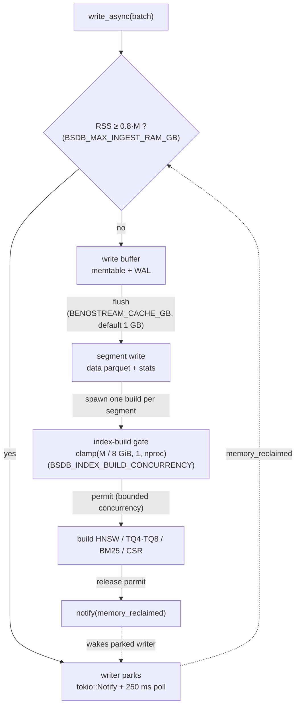

# Resource Limits and Back-pressure

BenoStreamDB is a long-running process, so every resource it can exhaust has an
explicit admission limit. This is the single reference for the knobs; each one is
also documented at its implementation site.

The design principle throughout: **throttle, then fail with a clear error** —
never grow until the OS intervenes. Where a limit is hit the engine either blocks
(resuming automatically) or returns an error, and in both cases emits telemetry.

Every limit is **active by default**. There is no "off unless configured" switch:
an unset environment variable means "use the memory-derived default", not
"disable the guard". This is what lets the same binary run safely in a 4 GB
container and scale up to a large host.

## How the memory knobs interact

All memory limits are derived from one number — the memory actually available to
the process — and then layered so that *admission*, *reclamation*, and
*concurrency* all scale together.

### The ingest back-pressure loop

`M = effective_memory_bytes()`; `RSS` is the process's own `VmRSS`. Admission and
reclamation share the same default (`0.8·M`), so the moment a writer parks is also
the moment the next unit boundary attempts reclamation — keeping the pause as
short as the allocator allows.

### 1. Detection: `effective_memory_bytes()`

`core::resources::effective_memory_bytes()` resolves, in order:

1. **cgroup v2** — `/sys/fs/cgroup/<path>/memory.max` (the process's own cgroup
   from `/proc/self/cgroup`, then the root path). `max` means "no limit".
2. **cgroup v1** — `/sys/fs/cgroup/memory/<path>/memory.limit_in_bytes`. The
   `0x7FFF_FFFF_FFFF_F000` sentinel means "no limit".
3. **Process `RLIMIT_AS`** — a hard address-space ceiling set by `ulimit -v` or a
   sandbox. This is the only per-process limit on macOS, which has no cgroups
   (it is usually unlimited there, in which case host RAM is used).
4. **Host *available* memory** — `/proc/meminfo` `MemAvailable` (Linux), falling
   back to `MemTotal` (Linux) or `sysctl hw.memsize` (macOS). Available, not
   total: on a shared machine `MemTotal` overstates what this process can
   allocate, so guards sized from it never trip before the OS OOM-killer does
   (the demo load was killed at ~74 GB RSS on a 121 GiB host because the derived
   high-water mark was ~102 GB). A cgroup limit or `RLIMIT_AS` ceiling is a hard
   cap and is used as-is; only the host-RAM fallback switches to available.
5. **Fallback** — `FALLBACK_MEMORY_BYTES` = **4 GiB**, so an environment where
   nothing can be detected is treated as a small container rather than an
   unbounded host.

RSS is read from the same place on every platform — `/proc/self/status` `VmRSS`
on Linux, `task_info(MACH_TASK_BASIC_INFO)` on macOS — so the back-pressure
high-water mark and the heap-trim policy agree on what "over budget" means.

This is the key fix for serverless: a 4 GB container on a 32 GB host reports
**4 GB**, not 32 GB, so the guards trip at the right point instead of letting the
container OOM.

### 2. Derivation: the three memory knobs

Let `M = effective_memory_bytes()` and `F = MEMORY_BUDGET_FRACTION = 0.8`.

| Knob | Default | Role |
| --- | --- | --- |
| `BSDB_MAX_INGEST_RAM_GB` | `F × M` (decimal GB) | **Admission.** `write_async` blocks before accepting more batches while RSS ≥ this. |
| `BSDB_INGEST_MEMORY_BUDGET_GB` | `F × M` (bytes) | **Reclamation.** At each committed ingest unit, if RSS ≥ this, the heap is trimmed and blocked writers are notified. |
| `BSDB_INDEX_BUILD_CONCURRENCY` | `clamp(M / 8 GiB, 1, nproc)` | **Concurrency.** Caps how many segment index builds run at once, which caps peak RSS. |

They reference the same `M`, so they move together:

- **Admission vs. reclamation.** The high-water mark and the trim budget share
  the same default (`0.8 × M`). The high-water mark is the *hard* stop — a writer
  parks until memory is freed. The trim budget is the *soft* trigger — it decides
  when a background task bothers to return freed pages and wake the parked
  writer. Because they coincide, the moment a writer parks is also the moment the
  next unit boundary attempts reclamation, so the pause is as short as the
  allocator allows. Setting the trim budget *below* the high-water mark makes
  reclamation more eager (more trims, shorter pauses); setting it *above* means
  the writer parks first and waits for the fallback poll.
- **Concurrency vs. admission.** The build gate bounds how many builds are in
  flight, and therefore how fast RSS climbs toward the high-water mark. On a
  small container the gate is `1`, so a single build's working set is the whole
  budget; on a large host it fans out. Raising `BSDB_INDEX_BUILD_CONCURRENCY`
  without raising the high-water mark just makes writers park more often.
- **Explicit overrides win.** Any of the three can be set independently; a
  non-positive value is ignored (the derived default applies) so a guard can
  never be accidentally disabled.

### 3. Worked examples

| Environment | `M` | `BSDB_MAX_INGEST_RAM_GB` | `BSDB_INGEST_MEMORY_BUDGET_GB` | `BSDB_INDEX_BUILD_CONCURRENCY` |
| --- | --- | --- | --- | --- |
| 4 GB container | 4 GiB | ~3.4 GB | ~3.4 GB | 1 |
| 16 GB container | 16 GiB | ~13.7 GB | ~13.7 GB | 2 |
| 32 GB host | 32 GiB | ~27.5 GB | ~27.5 GB | 4 |
| 128 GB host | 128 GiB | ~110 GB | ~110 GB | 16 (capped at `nproc`) |

## Memory

| Knob | Default | Effect |
| --- | --- | --- |
| `BSDB_MAX_INGEST_RAM_GB` | `0.8 × effective memory` | Ingest RAM high-water mark. When RSS exceeds it, `write_async` blocks before accepting more batches and resumes the instant a background task frees memory (a segment index build finishing, or an ingest heap trim) — woken by `tokio::sync::Notify` with a 250 ms bounded fallback poll. |
| `BSDB_INGEST_MEMORY_BUDGET_GB` | `0.8 × effective memory` | Heap-trim budget. Returning freed pages to the OS is an allocator concern, so see `core::memory` for the rationale. Also settable per ingest via `IngestOptions::memory_budget_bytes` / `bsdb table ingest --memory-budget-gb`. |
| `BSDB_INDEX_BUILD_CONCURRENCY` | `clamp(effective memory / 8 GiB, 1, nproc)` | Maximum concurrent segment index builds. Each build holds its segment's vectors plus the HNSW/IVF/quantizer structures — several GB at a 1 GB flush size. Unbounded, the runtime fans out one build per worker thread, which is what OOM-killed the Wikipedia load at 105 GB RSS. Always bounded; a non-positive value is ignored. |

Observability: `benostreamdb_ingest_rss_bytes`,
`benostreamdb_ingest_backpressure_pauses_total`,
`benostreamdb_ingest_backpressure_pause_seconds`,
`benostreamdb_index_build_gate_wait_seconds`. A rising gate-wait time means the
build gate, not the CPU, is the throughput limit.

## Disk

| Knob | Default | Effect |
| --- | --- | --- |
| `BSDB_MIN_FREE_DISK_GB` | `1` | Free-space admission threshold for local (`file://`) tables. A write is refused with a descriptive error when the target filesystem is below it, so the failure happens *before* any bytes are written rather than mid-segment. Fail-open: if the free space cannot be queried, the write proceeds. A non-positive value is ignored. |

Observability: `benostreamdb_free_disk_bytes`, sampled at each flush.

The check walks up to the nearest existing ancestor of the staging path, so a
table directory that does not exist yet still resolves to its parent filesystem
(`core::resources`).

## CPU / concurrency

Parallelism is bounded wherever work is fanned out, rather than left to the
runtime's worker count:

| Site | Bound |
| --- | --- |
| Segment index builds | `BSDB_INDEX_BUILD_CONCURRENCY` (`Table::index_build_gate`) |
| Parallel segment reads during a vector search | `auto_detect_parallel_readers` semaphore (`core::query`) |
| Native bulk ingest | `IngestOptions::parallelism` (default 4) |
| Vector aggregation / GPU dispatches | one block per row, fixed block size (no unbounded grid) |

## Containers

The engine reads the container's cgroup limit directly, so no configuration is
needed to run in a 4 GB container — the defaults above are already sized for it.
`docker-compose.production.yml` sets `SEARCH_MEMORY`/`FLIGHT_MEMORY` (default
`4G`) and `SEARCH_CPUS` (default `2.0`); the engine's derived defaults follow
those limits. To pin a value explicitly, set the corresponding `BSDB_*` variable
in the service's `environment:` block.

## Validation

Memory and disk behaviour under saturation is asserted by
[`tests/stress/`](tests/stress/README.md) — a low ingest high-water mark must
pause and resume rather than OOM, and many commit cycles must stay durable. The
long-running variants run on push via
[`.github/workflows/soak.yml`](.github/workflows/soak.yml).
