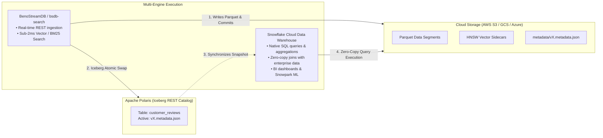

# Snowflake + Apache Polaris + BenoStreamDB Integration Guide

This guide walks through configuring a **Zero-Copy Open Data Lakehouse** connecting **BenoStreamDB**, **Apache Polaris**, and **Snowflake**. 

With this architecture:
- **BenoStreamDB** provides sub-2ms hybrid vector (HNSW) and full-text (BM25) search.
- **Apache Polaris** acts as the centralized open Iceberg REST catalog.
- **Snowflake** queries the exact same Parquet data natively using standard Snowflake SQL without data duplication, ETL pipelines, or storage lock-in.

---

## Architecture Overview



---

## Prerequisites

1. An **S3 Bucket** (or GCS/Azure container) storing your BenoStreamDB tables.
2. An active **Apache Polaris** instance (Open-source Polaris or Snowflake-managed Open Catalog).
3. A **Snowflake** account with `ACCOUNTADMIN` or privileges to create storage and catalog integrations.

---

## Step 1: Configure BenoStreamDB to Sync with Polaris

Configure `benostreamdb-search` using environment variables or a `benostream.toml` configuration file.

### Option A: Environment Variables

```bash
# Storage location for Parquet data and Iceberg metadata
export BENOSEARCH_STORAGE_URI=s3://my-lakehouse-bucket/tables

# Polaris Iceberg REST catalog configuration
export BENOSEARCH_CATALOG_TYPE=rest
export BENOSEARCH_CATALOG_URL=https://polaris.example.com/api/catalog/v1
export BENOSEARCH_CATALOG_CREDENTIAL="<POLARIS_CLIENT_ID>:<POLARIS_CLIENT_SECRET>"
export BENOSEARCH_CATALOG_PREFIX="my_warehouse"
export BENOSEARCH_CATALOG_NAMESPACE="production"
```

### Option B: `benostream.toml`

```toml
[storage]
type = "s3"
bucket = "my-lakehouse-bucket"
region = "us-east-1"

[catalog]
catalog_type = "rest"

[catalog.config]
url = "https://polaris.example.com/api/catalog/v1"
credential = "POLARIS_CLIENT_ID:POLARIS_CLIENT_SECRET"
prefix = "my_warehouse"
namespace = "production"
```

When you start `bsdb-search`, startup diagnostics confirm Polaris catalog synchronization:
```
INFO Initialized external Iceberg catalog from environment catalog_type=Rest namespace=production
```

---

## Step 2: Configure Storage Access in Snowflake (External Volume)

Create an `EXTERNAL VOLUME` in Snowflake pointing to the same S3 bucket where BenoStreamDB writes Parquet files:

```sql
CREATE OR REPLACE EXTERNAL VOLUME benostream_s3_volume
  STORAGE_LOCATIONS =
    (
      (
        NAME = 'my-s3-us-east-1'
        STORAGE_PROVIDER = 'S3'
        STORAGE_BASE_URL = 's3://my-lakehouse-bucket/tables/'
        STORAGE_AWS_ROLE_ARN = 'arn:aws:iam::123456789012:role/snowflake_s3_read_role'
      )
    );

-- Retrieve Snowflake IAM user ARN to authorize trust relationship in AWS IAM
DESCRIBE EXTERNAL VOLUME benostream_s3_volume;
```

---

## Step 3: Configure Polaris Catalog Integration in Snowflake

Create a `CATALOG INTEGRATION` in Snowflake that tells Snowflake how to query Polaris:

```sql
CREATE OR REPLACE CATALOG INTEGRATION polaris_iceberg_catalog
  CATALOG_SOURCE = ICEBERG_REST
  TABLE_FORMAT = ICEBERG
  CATALOG_NAMESPACE = 'production'
  REST_CONFIG = (
    CATALOG_URI = 'https://polaris.example.com/api/catalog/v1'
    WAREHOUSE = 'my_warehouse'
  )
  REST_AUTHENTICATION = (
    TYPE = OAUTH2
    OAUTH_CLIENT_ID = '<POLARIS_CLIENT_ID>'
    OAUTH_CLIENT_SECRET = '<POLARIS_CLIENT_SECRET>'
    OAUTH_ALLOWED_SCOPES = ('PRINCIPAL_ROLE:ALL')
  )
  ENABLED = TRUE;
```

---

## Step 4: Create the Table in Snowflake

Create an Iceberg table in Snowflake referencing the Polaris catalog table name:

```sql
USE DATABASE my_analytics_db;
USE SCHEMA public;

CREATE OR REPLACE ICEBERG TABLE customer_reviews
  EXTERNAL_VOLUME = 'benostream_s3_volume'
  CATALOG = 'polaris_iceberg_catalog'
  CATALOG_TABLE_NAME = 'customer_reviews';
```

---

## Step 5: Ingest via BenoStreamDB and Query in Snowflake

### 1. Ingest Data via BenoStreamDB Search API

Ingest documents via the OpenSearch-compatible REST API:

```bash
curl -X POST "http://localhost:9200/customer_reviews/_doc" \
  -H "Content-Type: application/json" \
  -d '{
    "review_id": 1001,
    "product": "Wireless Headphones",
    "rating": 5,
    "review_text": "Incredible sound isolation and deep bass.",
    "embedding": [0.12, -0.45, 0.88, 0.23]
  }'
```

* **What happens immediately:**
  1. BenoStreamDB persists the row to Parquet on S3.
  2. BenoStreamDB indexes the vector in the local HNSW sidecar for sub-2ms ANN search.
  3. BenoStreamDB triggers an **Iceberg Atomic Swap** to Apache Polaris, advancing the snapshot ID.

### 2. Query Natively in Snowflake

Run queries in Snowflake against `customer_reviews` immediately:

```sql
-- Standard SQL analytics & aggregations
SELECT 
    product,
    AVG(rating) AS avg_rating,
    COUNT(*) AS total_reviews
FROM customer_reviews
GROUP BY product
ORDER BY total_reviews DESC;

-- Native join with Snowflake enterprise data
SELECT 
    r.review_id,
    r.product,
    r.rating,
    o.order_total,
    o.customer_segment
FROM customer_reviews r
JOIN snowflake_internal.sales.orders o 
  ON r.review_id = o.review_reference_id
WHERE r.rating <= 2;
```

---

## Key Benefits

1. **Zero-Copy Architecture**: No `COPY INTO`, no Kafka-to-Snowflake connectors, and no duplicate storage charges.
2. **Dual-Speed Workloads**:
   * **Sub-2ms Interactive Search**: Applications query `bsdb-search` over HTTP for instant vector & full-text retrieval.
   * **Petabyte-Scale BI & SQL**: Data analysts and data scientists query the exact same data in Snowflake.
3. **Open Standards**: If you ever migrate away from Snowflake, all data remains in vanilla Apache Iceberg / Parquet format with Apache Polaris as the vendor-neutral catalog.
