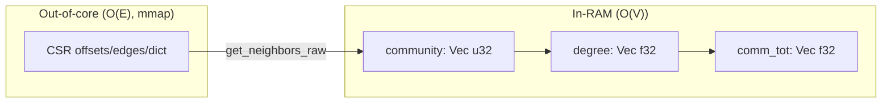

# Plan: Make Graph RAG hybrid (in-RAM + out-of-core)

Status: proposed
Related: [`src/core/memory.rs`](../src/core/memory.rs), [`src/core/resources.rs`](../src/core/resources.rs), [`src/core/cache.rs`](../src/core/cache.rs), [`src/core/sql/session.rs`](../src/core/sql/session.rs), [`src/core/sql/graph_udf/louvain_communities.rs`](../src/core/sql/graph_udf/louvain_communities.rs), [`src/core/sql/graph_udf/leiden_communities.rs`](../src/core/sql/graph_udf/leiden_communities.rs), [`src/core/index/csr_graph.rs`](../src/core/index/csr_graph.rs)

## Principle

**Move the O(E) working set out of RAM; keep only O(V) state resident.** The CSR is already the out-of-core adjacency (mmap'd, `MADV_RANDOM`). The graph algorithms should *read from it* instead of buffering the edge set. For a 6M-node / 383M-edge Wikipedia graph, O(V) state is ~72 MB while O(E) is ~7.7 GB — a 100x difference.

## G1 — CSR-backed community detection (biggest risk)

**Problem.** [`LouvainAccumulator`](../src/core/sql/graph_udf/louvain_communities.rs:104) and [`LeidenAccumulator`](../src/core/sql/graph_udf/leiden_communities.rs:110) hold `sources`/`targets`/`weights` as `Vec`s — ~20 bytes/edge, ~7.7 GB at 383M edges.

**Design.** Add `src/core/algorithms/communities.rs` with `louvain_csr(forward, resolution)` and `leiden_csr(forward, resolution)` that read adjacency from the mmap'd CSR via `get_neighbors_raw` and keep only O(V) state:

- `community: Vec<u32>` (4 B/node)
- `degree: Vec<f32>` (4 B/node)
- `comm_tot: Vec<f32>` (4 B/node)

The local-move and refinement phases are identical to the UDF versions; only the adjacency source changes. `Table.communities()` routes to the CSR path when `has_graph_index("source")`, else falls back to the UDF accumulator (small graphs / SQL convenience). For tables without a CSR, build one on the fly by reusing [`MmapCsrGraph::build_from_file`](../src/core/index/csr_graph.rs:88) into a temp dir.

**Acceptance.** Community detection on the wiki demo runs in bounded RSS (state only), and results match the UDF path on small graphs.

## G2 — Default DataFusion memory limit

**Problem.** [`BenoStreamSession::new(None)`](../src/core/sql/session.rs:27) sets no limit, and that is what [`bsdb.rs:122`](../src/bin/bsdb.rs:122) and [`graph.rs:58`](../src/python/graph.rs:58) use — so SQL sorts/joins/aggregations never spill.

**Design.** When `memory_limit_bytes` is `None`, default it to `effective_memory_bytes() * 0.5` (leaving headroom for the ingest buffer and index builds). Add `BSDB_DATAFUSION_MEMORY_GB` to override. This turns on DataFusion's disk spilling for the SQL path.

**Acceptance.** A large `ORDER BY`/join spills to disk instead of OOMing.

## G3 — Avoid full materialization in Graph RAG

**Problem.** [`graph_rag_search`](../python/benostreamdb/__init__.py:1134) materializes subgraph edges into pandas just to compute `neighborhood_nodes`; [`summarize_communities`](../python/benostreamdb/__init__.py:1564) does `SELECT * FROM t` over the whole doc table.

**Design.**
- Add `subgraph_nodes()` (visited set only, no edge join) and use it for `neighborhood_nodes`; materialize edges only for the final result, capped by `max_nodes`.
- In `summarize_communities`, replace `SELECT * FROM t` with a projection (`id`, `content`, `title`) and a `WHERE id IN (top_entities)` per community, or stream in batches.

**Acceptance.** Graph RAG peak RSS scales with `max_nodes`, not with the graph size.

## G4 — Individual knobs, not a unified budget (decided)

**Decision.** A single coordinated `MemoryBudget` with a fixed percentage split
was prototyped and **rejected**: operators prefer independent knobs so each
subsystem can be tuned to the actual workload. The individual overrides stand:

| Subsystem | Override |
|-----------|----------|
| Ingest high-water mark | `BSDB_MAX_INGEST_RAM_GB` |
| Heap-trim budget | `BSDB_INGEST_MEMORY_BUDGET_GB` |
| DataFusion query limit | `BSDB_DATAFUSION_MEMORY_GB` |
| Index-build fan-out | `BSDB_INDEX_BUILD_CONCURRENCY` |

**What was kept.** The DataFusion limit is *bounded and configurable*: it
defaults to `DATAFUSION_MEMORY_FRACTION` (50%) of the effective memory, and
`Table.execute_sql` — the path the graph UDFs run on — now applies it too (it
previously used an unbounded `SessionContext::new()`).

## Priority

1. **G1** — biggest risk, clear win, reuses the existing CSR.
2. **G2** — bounded + configurable DataFusion limit, enables spilling.
3. **G3** — bounded materialization in the Graph RAG path.
4. **G4** — resolved: independent knobs, no fixed split.
