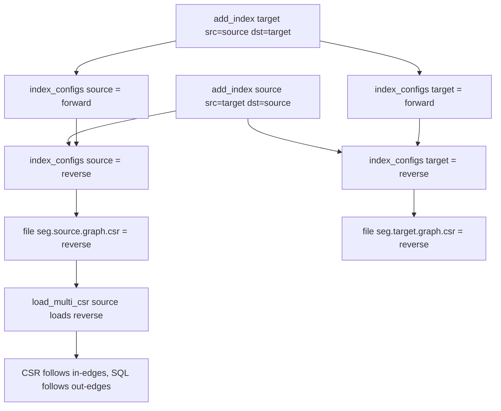
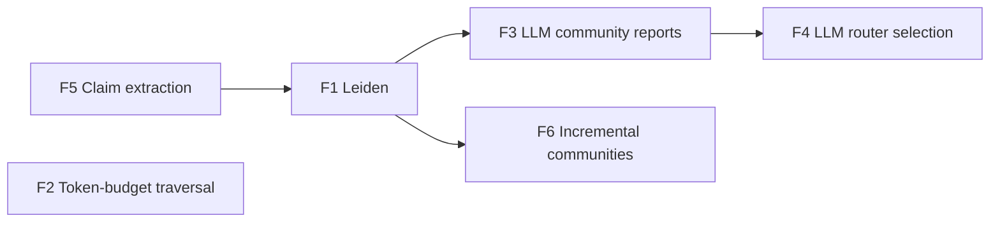

# Plan: Fix the CSR/SQL subgraph mismatch + Graph RAG feature specs

Status: proposed
Owner: architect
Related: [`src/python/helpers.rs`](../src/python/helpers.rs), [`src/python/table.rs`](../src/python/table.rs), [`src/core/table/index_config.rs`](../src/core/table/index_config.rs), [`src/core/segment.rs`](../src/core/segment.rs), [`src/core/index/build_graph.rs`](../src/core/index/build_graph.rs), [`tests/python/test_csr_subgraph.py`](../tests/python/test_csr_subgraph.py)

---

## Part 1 — Fix the CSR/SQL subgraph mismatch

### Symptom

On the synthetic ring graph, the CSR fast path and the SQL `bfs_visited` path return different induced edge sets:

| hops | directed | SQL edges | CSR edges | equal |
|------|----------|-----------|-----------|-------|
| 1 | true  | 22  | 10  | no |
| 1 | false | 40  | 34  | no |
| 2 | true  | 81  | 37  | no |
| 2 | false | 186 | 200 | no |

The CSR path follows the **wrong direction** (in-edges instead of out-edges).

### Root cause

A graph index is identified in the manifest by `column_name`, but `add_index` populates the in-memory `index_configs` map with **two** keys for a single graph index: the algorithm's `src_column` and the original `column` argument. Two graph indexes (forward + reverse) therefore collide and clobber each other, and the physical CSR files end up mislabeled.

Trace:

1. `add_index(column, CsrGraph { src_column, dst_column })` sets `target_col = src_column` ([`index_config.rs:134`](../src/core/table/index_config.rs:134)).
2. `set_index_columns({ src_column: [CsrGraph] })` sets `index_configs[src_column] = CsrGraph` — correct.
3. Because `target_col != column`, the block at [`index_config.rs:203`](../src/core/table/index_config.rs:203) **also** sets `index_configs[column] = CsrGraph` — spurious.
4. The segment writer iterates `index_configs` ([`segment.rs:831`](../src/core/segment.rs:831)) and builds one CSR per key, each from `(src_column, dst_column)`, naming the file `{seg}.{key}.graph.csr.*` ([`build_graph.rs:100`](../src/core/index/build_graph.rs:100)).
5. The manifest `column_name` is parsed from the filename ([`segment.rs:159`](../src/core/segment.rs:159)).
6. `load_multi_csr(table, graph_column)` matches `column_name == graph_column` ([`helpers.rs:90`](../src/python/helpers.rs:90)) and treats the CSR as forward out-neighbours.

For the test's two calls:

- `add_index("target", { src: "source", dst: "target" })` → keys `source` and `target`, both **forward**.
- `add_index("source", { src: "target", dst: "source" })` → keys `target` and `source`, both **reverse** (the second call overwrites the first).

Net result: both `{seg}.source.*` and `{seg}.target.*` are **reverse**. `graph_column="source"` loads a reverse CSR, so the CSR path follows in-edges while the SQL path follows out-edges.



### Fix

In `add_index`, do not create the duplicate `index_configs[column]` entry for `CsrGraph`. A graph index is identified solely by its `src_column`, which is exactly the contract documented in [`helpers.rs:71`](../src/python/helpers.rs:71).

Change [`index_config.rs:203`](../src/core/table/index_config.rs:203) from:

```rust
if target_col != column {
```

to:

```rust
if target_col != column && !matches!(algorithm, IndexAlgorithm::CsrGraph { .. }) {
```

Result: `index_configs` has exactly one entry per graph index, keyed by `src_column`; the manifest `column_name` equals `src_column`; `load_multi_csr(table, src_column)` loads the forward CSR.

### Migration

Existing tables built with the buggy code have mislabeled CSR files, and the backfill idempotency check ([`entry_has_index`](../src/core/table/index_config.rs:660)) would skip rebuilding them. Add a one-time rebuild trigger:

- Record a `graph_index_format` version in the manifest (or a sentinel in the index metadata).
- On open, if the version is absent, force `backfill_indexes` for graph columns.

### Tests

- Fix the 7 failing equivalence tests in [`test_csr_subgraph.py`](../tests/python/test_csr_subgraph.py).
- Add a regression test: with both forward and reverse indexes, `has_graph_index("source")` and `has_graph_index("target")` are both true, and CSR directed/undirected match SQL for hops 1 and 2.
- Add a test: with only a forward index, `has_graph_index("source") == True` and `has_graph_index("target") == False`.
- Add a test: `add_index` on a graph column does not create a spurious `index_columns` entry for the ignored `column` argument.

---

## Part 2 — Graph RAG feature specs

The following six capabilities are not yet implemented. Each spec lists goal, design, API, data model, acceptance criteria, and dependencies.



### F1 — Leiden community detection

- **Goal**: produce well-connected communities, fixing Louvain's badly-connected-community failure mode. Listed as an open question in [`docs/ROADMAP.md`](../docs/ROADMAP.md:18).
- **Design**: implement Leiden (local move + refinement + aggregation) in Rust under `src/core/algorithms/leiden.rs`, reusing the CSR adjacency for the local-move phase. Keep Louvain as the default; select via an `algorithm` parameter.
- **API**: `Table.leiden_communities(resolution=1.0, max_levels=...)`; `summarize_communities(..., algorithm="leiden")`; `graph_rag_search(..., community_algorithm="leiden")`.
- **Data model**: same output schema as [`louvain_communities`](../python/benostreamdb/__init__.py:591) — a `community` list column.
- **Acceptance**: modularity at least equal to Louvain on the wiki demo; every community is internally connected; deterministic given a seed.
- **Dependencies**: none.

### F2 — Token-budget-aware traversal truncation

- **Goal**: stop BFS expansion when the accumulated context budget is exhausted, not only by degree. `max_degree` is a degree proxy; this is the true budget.
- **Design**: extend [`csr_bfs_visited`](../src/python/helpers.rs:137) with `max_nodes: Option<usize>`. Track `visited.len()`; stop expanding once the cap is reached. Optionally rank the frontier by PPR or degree so the most relevant nodes are kept. The SQL fallback applies the same cap after `bfs_visited`.
- **API**: `subgraph(..., max_nodes=...)`; `graph_rag_search(..., context_budget_tokens=..., max_nodes=...)`.
- **Data model**: none.
- **Acceptance**: bounded memory regardless of graph density; deterministic; documented interaction with `max_degree`.
- **Dependencies**: none.

### F3 — LLM-generated community reports

- **Goal**: model-authored community summaries, embedded as first-class retrieval units (Microsoft GraphRAG parity).
- **Design**: extend [`summarize_communities`](../python/benostreamdb/__init__.py:1484) with an optional `llm` callable and an `embed` callable. Generate a report per community from member text, store it, and build an HNSW index on the report embedding.
- **API**: `summarize_communities(doc_table, target_uri, llm=..., embed=..., report_column="report")`.
- **Data model**: community table gains `report` (string) and `embedding` (list of float32); HNSW index on `embedding`.
- **Acceptance**: global search can retrieve communities by vector similarity; reports are cached and resumable.
- **Dependencies**: F1.

### F4 — Dynamic community selection via an LLM router

- **Goal**: rate branch relevance with a cheap model before descending, pruning irrelevant subtrees.
- **Design**: in global search, for each top-level community, call `llm_router(query, community_report) -> score`; prune subtrees below `relevance_threshold`. Fall back to the existing `seed_overlap` heuristic when no router is supplied.
- **API**: `graph_rag_search(mode="global", llm_router=..., relevance_threshold=...)`.
- **Acceptance**: fewer communities processed for the same recall; router calls are batched and cached.
- **Dependencies**: F3.

### F5 — Claim/co-variate extraction

- **Goal**: extract entities, relationships, and claims from text into the edge table, so the graph is built rather than assumed.
- **Design**: `extract_graph(doc_table, llm=..., schema=...)` produces nodes, edges, and a separate claims table with `subject`, `object`, `claim`, `source_doc`, `confidence`. Idempotent and resumable per document.
- **API**: `Table.extract_graph(doc_table, target_uri, llm=..., schema=...)`.
- **Data model**: edge table (`source`, `target`, `relation`, `weight`) plus a claims table.
- **Acceptance**: schema-validated output; resumable; deterministic given a seed.
- **Dependencies**: none.

### F6 — Incremental community updates

- **Goal**: maintain communities as edges arrive without a full recompute.
- **Design**: track a dirty node set on commit; run local Leiden/Louvain refinement on affected communities; periodically full recompute to bound drift. Persist community IDs so they remain stable across updates.
- **API**: `Table.update_communities(incremental=True)`; `summarize_communities(..., incremental=True)`.
- **Acceptance**: bounded work per commit; community IDs stable; drift bounded by a configurable threshold.
- **Dependencies**: F1.

---

## Execution order

1. Part 1 fix + regression tests (unblocks the CSR fast path).
2. F2 token-budget traversal (small, independent, high value).
3. F1 Leiden.
4. F3 LLM community reports.
5. F4 LLM router selection.
6. F5 claim extraction.
7. F6 incremental communities.
