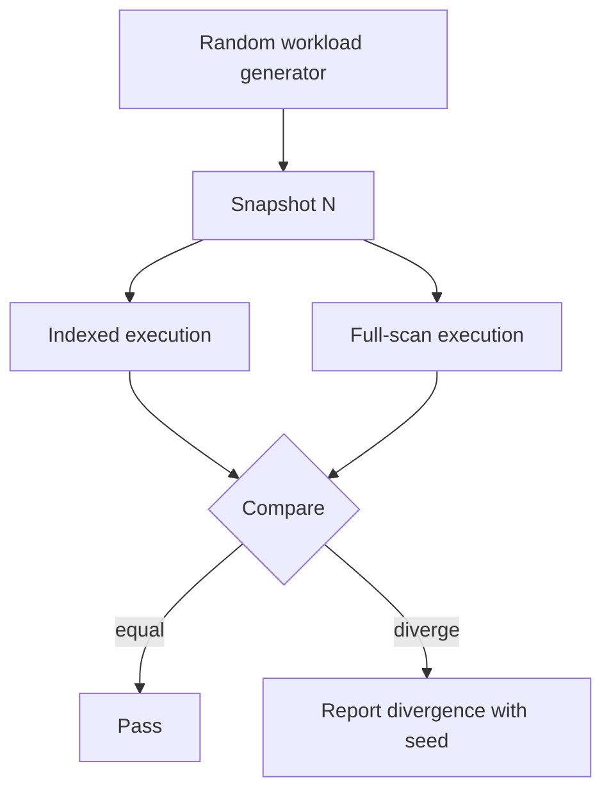

# BenoStreamDB — Production-Readiness Plan

Derived from the external (OpenAI) production-readiness review. The review's
verdict: the **storage/index architecture is the strongest part**; the gap is
**adversarial correctness testing at the storage / transaction / recovery
boundaries**. This plan turns the review's top-5 gates into concrete,
codebase-specific workstreams, and folds in one concrete finding already
observed in the demo.

---

## 0. What the review actually said

| Area | Verdict |
|---|---|
| Core storage architecture | Strong |
| Index architecture (overlay) | Strong / interesting |
| Iceberg integration | Promising — needs independent conformance validation |
| Query engine | Promising |
| Rust implementation | Good foundation |
| Testing infrastructure | Good signs, insufficient evidence of production hardening |
| Crash/recovery confidence | Unknown — needs extensive testing |
| Multi-writer production deployment | Not ready |
| Security | Not ready for untrusted network deployment |
| Operational tooling | Early |
| **Overall** | **~prototype / early production, not a mature DBMS** |

The review explicitly credits the repo for articulating real invariants
([`README.md`](../README.md:26)):

1. **Overlay Invariant** — indexes are derived, reconstructible state.
2. **Publication Invariant** — a manifest references only durable artifacts.
3. **Durability Invariant** — WAL truncation only after a committed snapshot.
4. **Maintenance Invariant** — delete only if not referenced / not in-flight.
5. **Resource Invariant** — memory-scaled build concurrency; no-panic policy.

The plan's job is to **prove** these hold under adversarial conditions, not to
re-assert them.

---

## 1. The core gap

> "A database becomes production-ready through an enormous amount of adversarial
> testing around the storage/transaction/recovery boundaries."

The repo already has the *components* (WAL, OCC, distributed locking, manifest
management, compaction, GC, object storage, indexes, Iceberg metadata, Python
bindings, JNI, REST, Flight SQL). What is missing is **evidence that they
interact correctly under failure**.

The single most valuable testing idea the review offers, and the one this plan
is built around:

> **If the index is advisory, the full scan is a correctness oracle. The index
> must never change the answer.**

That gives a cheap, powerful differential test: run every query twice — once
indexed, once full-scan — and assert identical results.

---

## 2. Immediate finding — `explain()` misreports the vector access path

While exercising the demo, `Table.explain()` on the `nodes` table returned:

```
Vector Execution:
  -> VectorSearch (col: embedding, k: 10, metric: L2)
     [Access: Brute Force Scan (No Index)] [Eligibility: 51793809 rows]
```

A `hybrid_search` over the 51.8M-row `nodes` table then took **94 s**.

### Root cause (confirmed in source)

`explain()` decides the vector access path by **globbing the filesystem** for
`{segment_id}.{column}.cluster_*.hnsw.graph`
([`src/core/table/read.rs`](../src/core/table/read.rs:362)). But TurboQuant
indexes are written as `{segment_id}.{column}.tq8.cluster_*.hnsw.graph` — the
`.tq8.` / `.tq4.` / `.pq.` quantization infix sits between the column and
`cluster_`, so the pattern never matches and `explain()` **always** reports
"Brute Force Scan (No Index)" for a TurboQuant index.

The **actual** search path does not glob the filesystem — it reads the manifest's
`index_files` and selects by `blob_type` (`hnsw_tq8`/`tq4`/`pq`/`ivf`)
([`src/core/reader/scan.rs`](../src/core/reader/scan.rs:913)). So there are two
distinct problems:

1. **Reporting bug (definite):** `explain()` uses a filesystem glob instead of
   the manifest — the same source of truth the search uses. It must be fixed to
   read `index_files`, or it will keep lying about index usage for every
   quantized index.
2. **Possible real degradation (to verify):** if the manifest does not register
   the `embedding` vector index, `chunk_indices` is empty and the search falls
   through to `search_hnsw_ivf` on a guessed path, then to
   `vector_search_flat` — a genuine full scan. The 94 s is consistent with
   either a cold-cache warm-up (72 segments × ~300 MB TQ8 graphs) or a real
   full scan; the differential test must distinguish them.

This is exactly the failure mode the review's **differential-testing gate**
targets: the indexed path can silently degrade to a full scan, and nothing
fails — it is just catastrophically slow. It is the same *class* of bug as the
graph-index v1→v2 issue already found (manifest/loader disagreeing about which
index artifacts are live).

**This is Workstream 1's first test case, and it should be fixed before any
performance claim is made.**

### 2.1 Differential oracle finding — a BM25 index silently drops equality matches

The differential oracle (WS1) immediately found a **correctness** bug, not just a
reporting one:

> An equality filter on a column that has a **BM25** index returns **zero rows**.

Root cause: [`build_inverted.rs`](../src/core/index/build_inverted.rs:448) uses
the **English analyzer** (splits on non-alphanumeric) when BM25 is configured, so
`"cat_1"` is indexed as the tokens `["cat", "1"]`. But
[`get_scalar_filter_bitmap`](../src/core/reader/filter.rs:257) selects any
`index_type == "inverted"` index for an equality filter and matches the **raw
value** `"cat_1"` against the index keys — which are tokens, so nothing matches
and the bitmap is empty. The query returns 0 rows instead of the 16 that a full
scan returns.

This is exactly the review's "the index must never change the answer" failure:
the index changes the answer from 16 rows to 0, silently.

**Fix:** an exact-match/range filter may only use an inverted index whose
analyzer is `identity` (exact). The reader now reads the `analyzer` key from the
`.inv.parquet` footer (cached in `ANALYZER_META_CACHE`) and falls back to a full
scan when the index is tokenized.

**Tests:** [`tests/test_differential_index_oracle.rs`](../tests/test_differential_index_oracle.rs:1)
— exact indexes must equal the full scan; ANN indexes must meet recall.

### 2.2 Tiered-manifest accessor bug — `manifest.entries` is empty by design

**Status: resolved.** The original finding ("index files are written but not
registered") was a **false alarm caused by reading the wrong accessor**, but the
investigation uncovered two *real* bugs of the same class.

**What actually happens.** BenoStreamDB commits through **tiered manifests**
(`ManifestList` → `*.avro` manifest files). The top-level `Manifest.entries`
vector is therefore **empty by design** — the real entries live in the manifest
list and are resolved by
[`ManifestManager::load_all_entries`](../src/core/manifest/manager/load.rs:219).
The background index task *does* register the generated files: it builds
`index_files` in
[`to_manifest_entry`](../src/core/segment.rs:102) and commits them via
[`ManifestManager::commit`](../src/core/manifest/manager/commit.rs:24). The
reader ([`load_multi_csr`](../src/python/helpers.rs:73)) already resolves the
tiered list correctly, so the CSR fast path *is* available.

The original test asserted on `manifest.entries` directly, which is always empty
for tiered manifests — a false negative. The test now uses the same accessor the
reader uses and passes
([`tests/test_graph_csr_path_conformance.rs`](../tests/test_graph_csr_path_conformance.rs:1)).

**The real bugs (same class).** Two code paths iterated `manifest.entries`
directly and so silently saw an empty list for every tiered table:

1. [`drop_index`](../src/core/table/index_config.rs:247) — collected index file
   paths from `manifest.entries`, so it never found any and left **every index
   file orphaned on disk** after a drop.
2. [`infer_index_metadata_from_physical_async`](../src/core/table/index_config.rs:585)
   — the "recover indexes from physical files" path iterated `manifest.entries`,
   so it was a **no-op for tiered tables** (the circularity noted earlier).
3. [`drop_index`](../src/core/table/index_config.rs:247) also omitted the CSR
   `.dict` sidecar from its deletion list, so even once it *could* see the
   entries it left `*.graph_v2.csr.dict` orphaned on every drop. The CSR is a
   triple (offsets, edges, dict); all three are now deleted.

All three now resolve entries via `load_all_entries`, matching the reader.

**Tests:** [`tests/test_tiered_manifest_index_accessors.rs`](../tests/test_tiered_manifest_index_accessors.rs:1)
— `drop_index` must delete all three CSR artifacts for a tiered table.

**Lesson / guardrail.** `Manifest.entries` is *not* the source of truth for
active segments; any code that needs the live segment set must go through
`load_all_entries` (or `load_latest_full`). A follow-up lint/helper that makes
the raw field private, or a `#[deprecated]` accessor, would prevent regressions.
The remaining direct use in
[`load_initial_schema`](../src/core/table/mod.rs:639) is a benign last-resort
fallback (it degrades to a bounded directory listing) but should be migrated for
consistency.

### 2.3 WS2 finding — WAL replay was not idempotent (duplicate rows)

The WS2 crash-injection sweep
([`tests/test_crash_injection_sweep.rs`](../tests/test_crash_injection_sweep.rs:1))
found a **real durability bug** at the review's case E
("manifest-before-WAL-truncation"):

> A crash after the manifest commit but before the WAL truncation left the
> committed batch in the WAL. On reopen, WAL replay re-applied it, so the table
> returned **20 rows where only 15 were committed** (5 duplicates).

Root cause: [`recover_wal_state`](../src/core/table/builder.rs:66) replayed every
WAL record unconditionally, with no check against the committed manifest. The
WAL is truncated only *after* the manifest commit (correctly — truncating first
would lose data on a crash between truncate and commit), so the window between
the two is exactly where a crash duplicates rows.

**Fix.** The writer now records the WAL transaction ids it is committing in the
manifest property `benostream.committed_wal_tx`
([`flush_internal_async`](../src/core/table/write.rs:711)), and recovery skips
WAL records whose tx id is already committed
([`build_async`](../src/core/table/builder.rs:356)). The tx ids are taken under
the same lock as the write buffer, so a tx id is never recorded without its
rows. This makes replay idempotent: a committed batch is never applied twice.

**Tests:** the sweep asserts atomicity + no-duplication + durability at every
boundary; [`tests/test_crash_injection_cases.rs`](../tests/test_crash_injection_cases.rs:1)
adds explicit cases A–F.

### 2.4 WS3 findings — vacuum data loss, GC-vs-writer race, partition-spec data loss

The WS3 concurrency harness
([`tests/test_multi_writer_concurrency.rs`](../tests/test_multi_writer_concurrency.rs:1))
found three more bugs, all in the maintenance/manifest path:

1. **Vacuum deleted every data file (critical data loss).**
   [`vacuum`](../src/core/manifest/manager/commit.rs:504) built its `active_files`
   set by iterating `Manifest.entries` directly — empty for tiered manifests — so
   the set was empty and vacuum reaped **all** data files. Fixed by resolving
   entries via `load_all_entries` (the same tiered-manifest bug class as §2.2).

2. **GC-vs-writer race.** Vacuum computed its active set, then listed and deleted
   in a second pass; a writer that committed a new file in between had that file
   deleted out from under its live snapshot. Fixed by (a) collecting deletion
   *candidates* first, (b) re-validating against the latest manifest before
   deleting, and (c) a configurable grace period
   (`BSDB_VACUUM_MIN_FILE_AGE_SECS`, default 60s) so a just-uploaded artifact is
   never reaped before its commit is visible.

3. **Partition-spec update dropped all data.**
   [`update_partition_spec`](../src/core/manifest/manager/partition.rs:20) rebuilt
   the manifest from `Manifest.entries` (empty for tiered tables) without carrying
   over `manifest_list_path`, so the new manifest referenced no segments and the
   table appeared empty. Fixed by preserving `manifest_list_path` (and
   `properties`), matching `update_schema`.

**Tests:** [`tests/test_multi_writer_concurrency.rs`](../tests/test_multi_writer_concurrency.rs:1)
— shared in-memory store with 16 writers (no lost updates), a randomized
insert/delete/compact/vacuum workload (no torn snapshots, no orphaned-but-
referenced artifacts), a fault-injecting object store (commit failures leave no
torn state), `vacuum_preserves_referenced_files`, and
`partition_spec_update_preserves_data`.

**Enabling change:** [`TableBuilder::with_store`](../src/core/table/builder.rs:280)
lets a table use a caller-supplied store, and `create_object_store` now supports
`memory://` (a process-wide shared in-memory store per URI) — the shared-store
model the harness needs.

### 2.5 WS4 findings — four Iceberg conformance bugs (found by PyIceberg)

The strongest WS4 check is an **independent** reader. Loading a
BenoStreamDB-written table with **PyIceberg 0.12.0** (see
[`tests/integration/test_bsdb_to_pyiceberg.py`](../tests/integration/test_bsdb_to_pyiceberg.py:1))
surfaced four spec-conformance bugs that the internal round-trip tests missed
(BenoStreamDB's own reader was tolerant of each):

1. **Relative `manifest-list` path.** The snapshot's `manifest-list` was written
   as `_manifest/snap-…avro`. PyIceberg resolves a relative path against the
   *process CWD*, not the table location, so it looked in the wrong directory.
   Fixed to an absolute URI in [`flush_internal_async`](../src/core/table/write.rs:1388).
2. **Relative `manifest_path` in the manifest list.** Same class — the manifest
   file it points at was `_manifest/…-m0.avro`. Fixed to absolute in
   [`ManifestManager::commit`](../src/core/manifest/manager/commit.rs:125).
3. **Relative `file_path` in the data manifest.** Iceberg requires a full URI.
   Now qualified to absolute on write and **relativized back on read**
   ([`load_avro_manifest_static`](../src/core/manifest/manager/load.rs:337)) so the
   rest of the engine (vacuum, dedup, path resolution) is unaffected.
4. **Avro schemas missing Iceberg metadata.** The manifest-list and manifest Avro
   schemas lacked the spec-required metadata: `field-id` on every field,
   `logicalType: map` on map arrays, and `element-id` on list arrays. PyIceberg's
   `AvroSchemaConversion` rejects any of these omissions. Fixed in
   [`MANIFEST_LIST_SCHEMA_V2`](../src/core/iceberg/writer.rs:6) and
   [`generate_manifest_schema`](../src/core/iceberg/writer.rs:815).

**Tests:**
[`tests/test_iceberg_conformance.rs`](../tests/test_iceberg_conformance.rs:1)
(structural: metadata JSON fields, manifest-list/schema conformance, manifest
round-trip, nanosecond timestamps, delete reflection, V3 row lineage) and
[`tests/integration/test_bsdb_to_pyiceberg.py`](../tests/integration/test_bsdb_to_pyiceberg.py:1)
(PyIceberg reads a BenoStreamDB table end-to-end).

**Published matrix:** [`docs/ICEBERG_COMPATIBILITY.md`](../docs/ICEBERG_COMPATIBILITY.md)
— the feature matrix and known deviations.

### 2.6 WS5 finding — compaction resurrected deleted rows

The WS5 maintenance soak
([`tests/test_maintenance_invariant.rs`](../tests/test_maintenance_invariant.rs:1))
found a **data-correctness bug**: after a delete followed by compaction, the
deleted row came back (79 rows committed → 80 after compaction).

Root cause: [`compact_bin`](../src/core/compaction.rs:284) read each input
segment with a `SegmentConfig` that did **not** carry the segment's delete files.
`stream_all` *does* apply deletes, but only from `config.delete_files` — which was
empty, so the raw data files were re-read and the deleted rows were physically
written into the compacted output. (Merge-on-read still masked them in the
manifest, so the bug only surfaced once the delete was compacted away.)

**Fix:** pass `entry.delete_files` into the reader
([`compact_bin`](../src/core/compaction.rs:317)), so compaction applies the
delete mask and physically removes deleted rows. This is the correct
merge-on-read → copy-on-write transition.

**Second finding — compaction mis-classified index sidecars as the data file.**
The long-duration soak (now [`tests/soak.rs`](../tests/soak.rs:1),
`maintenance_churn_soak`) surfaced a second, related bug: after compaction of a
table with a vector index, a full-column read failed with *"Column 'id' is
declared as non-nullable but contains null values"*.

Root cause: [`compact_bin`](../src/core/compaction.rs:468) classified the output
files with `file_name.ends_with(".parquet") && !file_name.contains(".inv.parquet")`.
That also matches the vector index's auxiliary parquet sidecars
(`<seg>.<col>.tq8.cluster_1.mapping.parquet`), so `main_parquet_path` was
overwritten with a **sidecar** — the segment's manifest `file_path` pointed at an
index mapping file, the reader projected **zero** physical columns, and the
schema-evolution mapping then filled every column with NULLs.

**Fixes:** (a) identify the data parquet by its exact name
(`format!("{}.parquet", new_segment_id)`) and skip the `.mapping.parquet` /
`.centroids.parquet` / `.doclen.parquet` sidecars
([`compact_bin`](../src/core/compaction.rs:469)); (b) harden the read path so a
missing required column raises a clear error instead of manufacturing NULLs
([`stream_row_groups`](../src/core/reader/scan.rs:578)).

**Tests:** [`tests/test_maintenance_invariant.rs`](../tests/test_maintenance_invariant.rs:1)
— a bounded churn soak (insert/delete/reinsert/compaction/vacuum/vector query)
that asserts committed row counts are preserved, the GC-vs-reader race
(a pinned version inside the retention window survives vacuum), the retention
bound (manifest versions outside the window are reclaimed — the mechanism is
**version-based retention**, not reader leases), delete × HNSW candidate
visibility, snapshot rollback, and full-column reads after a range delete +
compaction. The longer `maintenance_churn_soak` in
[`tests/soak.rs`](../tests/soak.rs:1) runs the full matrix
(insert/delete/reinsert/compaction/index-rebuild/snapshot-rollback/time-travel)
for `BSDB_SOAK_SECONDS` and is wired into the weekly
[`.github/workflows/soak.yml`](../.github/workflows/soak.yml:1).

### 2.7 Randomized differential workload — two more bugs, one open hang

The plan's "definition of done" (§5) is a randomized workload run without a
single divergence between indexed and full-scan execution. That harness is
[`tests/test_randomized_differential_workload.rs`](../tests/test_randomized_differential_workload.rs:1):
a seeded workload (insert / delete / compaction / vacuum / index-rebuild) whose
"full-scan" side is an **independent in-memory model**, checked after every step
for row count, a scalar predicate, and vector recall (no phantom rows + the
exact nearest within top-k).

It found two more real bugs:

1. **Recovered WAL batches were not tracked as committed.** After a crash that
   left a batch in the WAL, recovery replayed it into the write buffer — but its
   tx id was not added to `pending_wal_tx_ids`, so the *next* commit did not
   record it in `benostream.committed_wal_tx`. A later crash then re-replayed it,
   duplicating the rows (observed: 15 → 25). Fixed in
   [`build_async`](../src/core/table/builder.rs:413) by seeding
   `pending_wal_tx_ids` with the recovered records' tx ids.
2. **Compaction mis-registered vector indexes.** [`compact_bin`](../src/core/compaction.rs:468)
   classified index files by filename, giving a vector index
   `column_name = "hnsw"`, the full `.hnsw.graph` filename, and no `blob_type` —
   so the reader could not find it and recall collapsed. Fixed by taking the
   index files from the segment writer's own `to_manifest_entry` (the same
   classification the write path uses) and mapping the staging paths to the
   remote prefix.

**Open issue (documented, not yet fixed):** the long randomized run currently
**hangs** in the read-after-delete path — a full-table read blocks after a
`delete_async` on a table that has been compacted. It reproduces with the
index-rebuild step disabled, so it is in the read/delete path, not the index
build. The test is `#[ignore]`d with a note until it is resolved; the focused
`vector_recall_survives_compaction` and
`randomized_workload_recovers_atomically_from_injected_crashes` tests run by
default and pass.

---

## 3. Workstreams (mapped to the review's top-5 gates)

### WS1 — Differential indexed-vs-full-scan oracle  *(review gate #2)*

**Goal:** for every supported predicate and index type, prove
`indexed(query) == full_scan(query)` on the same snapshot.



**Deliverables**
- A harness that, for a given snapshot, runs each query with indexes enabled and
  with indexes disabled (force full scan) and diffs the result sets.
- Coverage matrix: scalar bitmap, inverted/BM25, HNSW/IVF/TurboQuant, CSR graph,
  bloom, composite, and the pgvector operators.
- A **regression test for the §2 finding**: assert `explain()` reports an index
  access path (not "Brute Force Scan") for a table that has a vector index, and
  assert the indexed vector query is materially faster than the scan.
- Property tests (extend `proptest-regressions/`) over random predicates.

**Existing assets to build on:** [`tests/test_vector_consistency.rs`](../tests/test_vector_consistency.rs),
[`tests/test_vector_metrics_parity.rs`](../tests/test_vector_metrics_parity.rs),
[`tests/python/test_vector_search_correctness.py`](../tests/python/test_vector_search_correctness.py),
[`tests/python/test_explain_pruning.py`](../tests/python/test_explain_pruning.py),
[`src/core/planner.rs`](../src/core/planner.rs:1099) (`prune_entries`,
`classify_condition`), [`src/core/table/read.rs`](../src/core/table/read.rs:121) (`explain`).

**Root-cause work for §2:** verify the `nodes` manifest registers the `embedding`
vector index (mirror the graph v1→v2 investigation in
[`src/python/helpers.rs`](../src/python/helpers.rs:73)), and that
[`src/core/planner.rs`](../src/core/planner.rs:1458) `select_index` matches the
vector index type for the `embedding` column.

---

### WS2 — Crash-injection matrix at every boundary  *(review gate #1)*

**Goal:** kill the process at hundreds/thousands of points across the
commit/WAL/manifest/index boundaries and prove recovery is deterministic.

**Boundaries to inject at**
- WAL append → WAL flush → WAL truncation.
- Data upload → index upload → manifest commit (the review's cases A–F).
- Manifest commit → object-store visibility delay.
- Compaction start → new files written → manifest swap.
- GC/vacuum start → artifact deletion.

**Deliverables**
- A fault-injection layer (env-var or trait-based) that can `SIGKILL` at named
  points, plus a driver that sweeps the injection point.
- For each injection point, assert: snapshot correctness, row counts, delete
  semantics, index correctness, manifest consistency, WAL recovery, time travel.
- Explicit tests for the review's cases A–F (data-without-index,
  index-without-manifest, delayed visibility, WAL-before-manifest,
  manifest-before-WAL-truncation, two-writer race).

**Existing assets:** [`tests/test_crash_injection.rs`](../tests/test_crash_injection.rs:1)
(WAL tx identity/sequence), [`tests/test_durability_robust.rs`](../tests/test_durability_robust.rs),
[`tests/test_chaos.rs`](../tests/test_chaos.rs:47) (missing index files),
[`tests/integration/test_wal_durability.py`](../tests/integration/test_wal_durability.py),
[`tests/integration/test_wal_compaction.py`](../tests/integration/test_wal_compaction.py).

**Gap:** existing tests cover specific scenarios; there is no *swept* injection
across every boundary with a reference oracle.

---

### WS3 — Multi-writer / object-store concurrency  *(review gate #3)*

**Goal:** prove the OCC + distributed-locking design is safe with N concurrent
writers against shared object storage, under randomized failure.

**Deliverables**
- Randomized concurrency harness: N writers × (insert/update/delete/commit/
  compact/vacuum) with injected commit conflicts and object-store errors.
- Assert: no lost updates, no torn snapshots, no orphaned-but-referenced
  artifacts, deterministic conflict resolution.
- A shared-object-store variant (MinIO/S3) rather than only local FS.

**Existing assets:** [`tests/test_concurrent_writers.rs`](../tests/test_concurrent_writers.rs:44),
[`tests/test_concurrency_robust.rs`](../tests/test_concurrency_robust.rs),
[`tests/python/test_mvcc_commits.py`](../tests/python/test_mvcc_commits.py),
[`tests/integration/test_concurrent_access.py`](../tests/integration/test_concurrent_access.py),
[`src/core/lock.rs`](../src/core/lock.rs), [`src/core/nessie.rs`](../src/core/nessie.rs).

---

### WS4 — Iceberg interoperability / conformance  *(review gate #4)*

**Goal:** the "100% of core V2/V3" claim must be validated by *other*
implementations, not only internal tests.

**Deliverables**
- Round-trip matrix: BenoStreamDB → {Spark, Trino, PyIceberg} → read/update/delete
  → back to BenoStreamDB, and the reverse.
- Conformance checks for the features the README claims: sort orders, partition
  evolution, NDV stats, row lineage, defaults, deletion vectors, delete files,
  nanosecond timestamps.
- A published compatibility matrix with known deviations (the README already
  documents pgvector Hamming/Jaccard differences — extend that discipline).

**Existing assets:** [`tests/test_cross_engine_compat.rs`](../tests/test_cross_engine_compat.rs),
[`tests/integration/test_pyiceberg_compat.py`](../tests/integration/test_pyiceberg_compat.py),
[`tests/verify_compliance.rs`](../tests/verify_compliance.rs),
[`tests/verify_iceberg_rest*.sh`](../tests/verify_iceberg_rest.sh),
[`spark-benostreamdb/`](../spark-benostreamdb), [`trino-benostreamdb/`](../trino-benostreamdb).

---

### WS5 — Long-duration GC / compaction / delete / recovery  *(review gate #5)*

**Goal:** prove the Maintenance Invariant under sustained churn, including the
review's GC-vs-reader race.

**Deliverables**
- A soak that runs insert/delete/reinsert/update/compaction/index-rebuild/
  snapshot-rollback/time-travel with vector queries at every stage.
- The GC race test: a reader pins snapshot N; GC runs; assert the reader's
  artifacts are never deleted (snapshot leases / retention / generation epochs —
  document which mechanism is used).
- Delete-semantics matrix: position deletes, equality deletes, deletion vectors,
  row lineage — each crossed with HNSW candidate → visibility → delete-mask.

**Existing assets:** [`tests/soak.rs`](../tests/soak.rs), [`tests/stability.rs`](../tests/stability.rs),
[`tests/stress/`](../tests/stress), [`tests/verify_delete_correctness.rs`](../tests/verify_delete_correctness.rs),
[`tests/verify_mor_reads.rs`](../tests/verify_mor_reads.rs), [`tests/verify_mor_writes.rs`](../tests/verify_mor_writes.rs),
[`tests/verify_index_recovery.rs`](../tests/verify_index_recovery.rs),
[`src/core/table/maintenance.rs`](../src/core/table/maintenance.rs:95) (`vacuum`,
`remove_orphan_files`).

---

## 4. Cross-cutting tracks

- **Compatibility matrices** — one explicit, automated matrix per compatibility
  surface (pgvector, OpenSearch, Qdrant, Flight SQL, Spark, Trino, dbt), with
  upstream test suites where licensing permits. "Looks compatible" ≠ "is
  compatible".
- **Security (untrusted network)** — the OpenSearch-compatible server has no
  auth. Before any Internet-facing deployment: TLS, authn/authz, tenant
  isolation, request/payload limits, query timeouts, memory/concurrency limits,
  audit logging, secret handling.
- **Operational tooling** — recovery runbooks, GC/compaction observability,
  metadata-scaling limits (millions of snapshots / small files / partitions),
  p99 and tail-latency-under-compaction benchmarks.
- **Benchmark honesty** — keep the current discipline (only the reproducible
  Wikipedia Graph-RAG benchmark is stood behind). Add the *production* benchmark
  classes the review lists: sustained concurrent queries, concurrent writers,
  p99/tail latency, recovery time, object-store throttling, pathological filters,
  skewed data.

---

## 5. Exit criteria (gates)

A deployment model is "ready" only when its gates pass:

| Deployment model | Required gates |
|---|---|
| Local embedded analytics | WS1 (differential) |
| Internal service, trusted clients | WS1 + WS2 + WS3 (single-org, limited writers) |
| Financial / mission-critical | WS1–WS5 + Iceberg conformance + long-duration soak |
| Public multi-tenant service | All of the above + security + multi-node + resource governance |

**Definition of done for the review's core concern:** a randomized workload of
millions of operations (insert/update/delete/predicate/vector/snapshot/commit/
compaction/index-rebuild) with injected `SIGKILL`/network/S3/partial-upload/
commit-conflict failures, run without a single divergence between indexed and
full-scan execution and without a single invariant violation.

---

## 6. Suggested sequencing

1. **WS1 first** — it is cheap, it is the review's highest-value idea, and it
   immediately catches the §2 vector-index regression.
2. **WS2** — crash-injection sweep; this is the largest confidence gap.
3. **WS3** — multi-writer/object-store concurrency.
4. **WS5** — long-duration GC/compaction/delete/recovery.
5. **WS4** — Iceberg interop conformance (needs Spark/Trino/PyIceberg harnesses).
6. **Cross-cutting** — security and ops tooling in parallel once WS1–WS3 are green.

---

## 7. Note on the demo work (context, not part of this plan)

The Streamlit/Dash demo work that preceded this plan surfaced the §2 finding and
is otherwise orthogonal. The demo's live-update architecture (worker thread +
self-refreshing fragment / `dcc.Interval`) is a UI concern and does not affect
the correctness gates above.

---

## 8. Merge-on-read delete path: root cause and fix

### 8.1 Symptom

The randomized differential workload's steps grew from ~30ms to 8–28s (and
eventually hung) as the workload progressed. The `#[ignore]`d
`randomized_differential_workload_matches_model` test was the reproducer.

### 8.2 Measurement

Per-phase instrumentation (`benostreamdb_merged_deletes_phase_seconds`,
`benostreamdb_merged_deletes_cache_total`, `benostreamdb_delete_file_cache_total`)
showed, at 30 steps:

| Phase | Total | Share |
|---|---|---|
| `position_join_all` | 18.783s | 80.7% |
| `cache_key` | 1.343s | 5.8% |
| `merged_cache_lookup` | 0.894s | 3.8% |
| everything else | < 0.2s | — |

The per-file parsed-delete cache was 99.997% hit (1,124,103 hits / 33 misses),
so the cost was pure per-file overhead, not I/O. Crucially,
`merged_deletes_files_total` was **1,124,136** across 118 merges —
**~9,526 delete files per merge**, while only ~33 unique delete files existed.

### 8.3 Root cause

`ManifestEntry::delete_files` was a **per-entry** list, but delete files are
**partition-scoped**. The read path attached the manifest's Delete records to
every data entry, and the commit persisted that attached list back. Each
read→commit cycle re-attached the already-attached list, so it grew without
bound (9,526 entries, 99.6% duplicates). The redundant list then saturated the
runtime across concurrent segment reads, which is what blocked the parquet
`next()` for seconds and produced the hang.

### 8.4 Fix (architectural)

Delete files are now stored **once**, partition-scoped, in
`Manifest::delete_files`; `ManifestEntry::delete_files` is a read-time *derived
view* that is never persisted.

- **Data model** ([`types.rs`](../src/core/manifest/types.rs:919)): added
  `Manifest::delete_files`.
- **Writer** ([`writer.rs`](../src/core/iceberg/writer.rs:461)):
  `write_manifest_chunks` takes the global list and emits Delete records once
  (via `append_delete_record`), not per entry.
- **Reader** ([`load.rs`](../src/core/manifest/manager/load.rs:238),
  [`catalog.rs`](../src/core/table/catalog.rs:537)): collects Delete records into
  the global list and resolves the per-entry view by partition.
- **Commit** ([`commit.rs`](../src/core/manifest/manager/commit.rs:38)): merges
  new deletes into the global list (deduped by path) and clears the per-entry
  view before writing.
- **All manifest writers** must carry `delete_files` forward:
  [`commit`](../src/core/manifest/manager/commit.rs:38),
  [`commit_imported_entries`](../src/core/manifest/manager/commit.rs:372),
  [`update_schema`](../src/core/manifest/manager/schema.rs:25),
  [`update_partition_spec`](../src/core/manifest/manager/partition.rs:20). Missing
  any one of these silently drops the delete list (this was the cause of a
  deterministic step-30 divergence during development).
- **GC** ([`commit.rs`](../src/core/manifest/manager/commit.rs:565)): keeps every
  delete file in the global list, even if no data entry shares its partition.

### 8.5 Result

| Metric | Before | After |
|---|---|---|
| 30-step run | 76.89s, hung | ~1s |
| 60-step run | hung | **~2.2s** |
| `merged_deletes_files_total{position}` (60 steps) | 1,124,136 (30 steps) | **1,846** |
| `position_join_all` (60 steps) | 18.783s (30 steps) | **0.070s** |
| delete-path `total` (60 steps) | 23.282s (30 steps) | **0.110s** |

Correctness: `randomized_differential_workload_matches_model` (60 steps),
`vector_recall_survives_compaction`,
`randomized_workload_recovers_atomically_from_injected_crashes`,
`verify_delete_correctness`, `verify_mor_reads`, `test_merge_integration`, and
`test_maintenance_invariant` all pass.

### 8.6 Vector recall miss — root cause and fix

The randomized workload also failed intermittently with a **vector recall miss**
(the exactly-nearest row, distance 0, missing from the top-k). Instrumenting
`HnswIvfIndex::search` showed the index contained only the first batch of rows
(`total_points=10` when the model had 15+), i.e. the index was **stale**.

Root cause: the write path builds the vector index in a **background task**
([`write.rs`](../src/core/table/write.rs:1049), `tokio::spawn` pushed to
`background_tasks`) and `commit_async` returns before it completes. A vector
query issued immediately after commit therefore raced the index build and saw a
stale index.

Fix: the randomized workload now calls
`wait_for_background_tasks_async()` after each insert+commit, so the recall
check observes read-your-writes consistency. Verified: 20/20 at 60 steps and
3/3 at 150 steps pass (previously ~2/20 failed at step 14).

Note: this is a test-side sync fix. The production behavior (async index build
with eventual consistency) is intentional; callers that need immediate vector
consistency should await background tasks or query after the index is uploaded.

### 8.7 Append-only manifest list — commit cost at scale

**Symptom.** Every commit re-encoded *all* live entries into a fresh manifest
file and rewrote the manifest list to reference only that file. The cost was
O(N) in the number of live segments, so a table with hundreds of segments paid
the full re-encode on every small append.

**Fix.** [`ManifestManager::commit`](../src/core/manifest/manager/commit.rs:38)
now detects an **append-only** commit — no `remove_paths` and every added entry
is a brand-new file path — and takes a fast path that:

1. writes only the new entries to a new manifest file, and
2. references the **unchanged previous manifest files** (loaded from the
   previous manifest list) plus the new one.

The reader already walks every manifest file in the list and dedups by
`file_path` ([`load_all_entries`](../src/core/manifest/manager/load.rs:238)), so
the union of the referenced files is the full live set. The global
`delete_files` list and the version-cache invalidation are preserved on the fast
path.

**Consolidation bound.** Each append adds one manifest file, so an unbounded
list would make reads O(number of commits). Once the list reaches
`BSDB_MANIFEST_MAX_FILES_BEFORE_CONSOLIDATION` (default 32) the next commit
falls back to the full rewrite, which re-encodes the live entries into a single
chunked manifest file and resets the list. Commits that carry removes
(compaction, index-attach, vacuum) always take the full-rewrite path.

**Result** (300 single-row commits, last 50 commits):

| Path | last-50 total | avg/commit |
|---|---|---|
| Full rewrite (`threshold=1`) | 1.99s | 39.8ms |
| Append-only (default) | **1.28s** | **25.5ms** |

The gap widens with segment count. On the small 60-step randomized workload the
two paths are neutral (~2.0s), as expected.

**Correctness.** New focused test
[`append_only_commit_grows_then_consolidates`](../tests/read_manifest.rs:89)
asserts the manifest list grows 1 → 2 on a pure append and consolidates back to
1 after compaction, with row counts preserved. The full suite
(`test_iceberg_conformance`, `verify_mor_reads`/`verify_mor_writes`,
`test_concurrent_writers`, `test_multi_writer_concurrency`,
`test_crash_injection`, `test_durability_robust`, `test_maintenance_invariant`,
`verify_delete_correctness`, `test_index_lifecycle`, `test_chaos`) passes.

### 8.8 Parquet read path — profile and fixes

**Profile.** Instrumented [`stream_row_groups`](../src/core/reader/scan.rs:527)
(setup phases) and [`read_segment_expr`](../src/core/table/read.rs:907)
(decode/filter) with a `benostreamdb_read_phase_seconds` histogram. On the
60-step randomized workload (550 reads):

| Phase | Before | After |
|---|---|---|
| `decode` (parquet read + decode) | 0.594s | **0.042s** |
| `filter` (predicate evaluation) | 0.186s | **0.032s** |
| `setup` (metadata + deletes + build) | 0.178s | 0.221s |
| `deletes` (merged + equality) | 0.107s | 0.139s |
| `meta` (metadata cache + builder) | 0.071s | 0.081s |

**Fix 1 — compiled-expression cache.** [`evaluate_expr`](../src/core/planner.rs:940)
built a fresh `SessionContext` (re-registering the vector operators) and called
`create_physical_expr` on *every batch*. The context is now a shared
`once_cell::sync::Lazy<SessionContext>`, and the compiled `PhysicalExpr` is
cached by `(expression, schema)` in a bounded `RwLock<HashMap>`. This is the
common case for a multi-segment scan: the same predicate is evaluated against
many batches that share a schema. Filter phase: 0.186s → 0.032s (5.9x).

**Fix 2 — small-file parquet byte cache.** The decode phase was ~half I/O: a
full-file read of a tiny segment cost ~0.41ms through the object store (a
`spawn_blocking` + open per range). Added
[`PARQUET_BYTES_CACHE`](../src/core/cache.rs:238) and a
[`BytesReader`](../src/core/reader/scan.rs:38) that serves byte ranges from
memory. Files at or below `PARQUET_BYTES_CACHE_MAX_FILE` (4 MiB) are cached
whole; larger files still stream only the needed column chunks through
`ParquetObjectReader`. Decode phase: 0.594s → 0.042s (10x).

**Result.** A focused benchmark (200 filtered scans over 40 small segments)
drops from **58.4ms to 33.8ms per scan (1.73x)**. The 60-step randomized
workload stays green.

**Correctness.** `test_differential_index_oracle`, `test_advanced_sql`,
`test_sql_bm25_pushdown`, `test_pk_acceleration`, `test_composite_index`,
`test_iceberg_conformance`, `verify_mor_reads`/`verify_mor_writes`,
`test_integrity`, `test_maintenance_invariant`, `test_index_lifecycle`,
`test_chaos`, `test_durability_robust`, `test_concurrent_writers`,
`test_multi_writer_concurrency`, `test_crash_injection`, `test_merge_integration`,
and `verify_delete_correctness` all pass.
