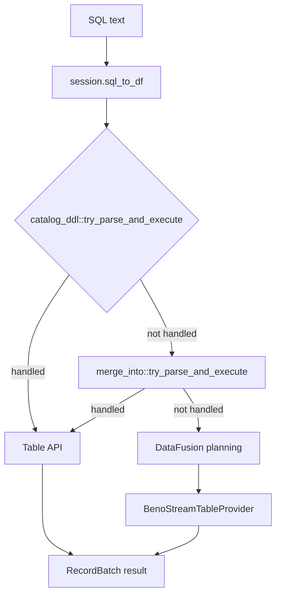

# Design: SQL DDL / Maintenance Surface over the Core `Table` API

Status: Draft for review
Scope: `src/core/sql/`, `src/core/catalog/`, `src/core/table/`, `server/flight_sql/`

## 1. Problem

BenoStreamDB's capabilities live on the Rust/Python `Table` API. The SQL layer
(DataFusion + the Flight SQL gateway) exposes only a fraction of them:

- `CREATE TABLE` over Flight SQL creates an ephemeral DataFusion `MemTable`, not a
  BenoStreamDB/Iceberg table.
- There is no SQL surface for indexes, primary keys, schema evolution, or
  maintenance (compaction, vacuum, orphan removal, index recovery).
- The Flight SQL server starts with an empty session and registers no tables.

Goal: make the SQL surface a faithful projection of the core `Table` API, so a
client can create catalog-backed tables, manage indexes/keys, evolve schemas, and
run maintenance entirely over SQL.

## 2. Key insight: intercept the AST, not DataFusion

DataFusion has no logical plan for `CREATE INDEX`, `OPTIMIZE`, `VACUUM`,
`MERGE`, `DELETE` (for custom providers), or `ALTER TABLE ... EXECUTE`. The
established pattern is to parse with DataFusion's re-exported `sqlparser` and
dispatch to the `Table` API *before* planning — see
[`merge_into::try_parse_and_execute()`](../../src/core/sql/merge_into.rs:57).

DataFusion 52 pins `sqlparser` 0.59, which already parses every statement we
need. So no DataFusion changes are required; the work is entirely in our
interception layer.

### Dialect

The session sets `datafusion.sql_parser.dialect = PostgreSQL`
([`session.rs:29`](../../src/core/sql/session.rs:29)). This matters:

| Statement | Parses under PostgreSQL? |
|---|---|
| `CREATE INDEX` | yes (unconditional) |
| `VACUUM` | yes (unconditional) |
| `OPTIMIZE TABLE` | no (ClickHouse/Generic only) |
| `COMPACT` | not a sqlparser statement |

Therefore the interception parser must use `GenericDialect` (mirroring
`merge_into.rs`), independent of the session dialect.

## 3. Architecture



A single new module `src/core/sql/catalog_ddl.rs` owns the interception. It is
called first in [`session.sql_to_df()`](../../src/core/sql/session.rs:144), before
`merge_into`. It returns `Ok(Some(batch))` when it handled the statement, else
`Ok(None)` so the existing pipeline runs.

`is_ddl()` and `get_schema()` must also consult it so the Flight SQL DDL path
executes the statement and returns no endpoints (already implemented for
`CREATE TABLE`).

## 4. Statement vocabulary and mapping

### 4.1 Catalog / namespace

| SQL | Core action |
|---|---|
| `CREATE DATABASE db` | create DataFusion catalog `db`; bind external catalog (from `CatalogConfig`) |
| `CREATE SCHEMA db.schema` | create DataFusion schema; `Catalog::create_namespace(schema)` |
| `DROP DATABASE db` | deregister DataFusion catalog |
| `DROP SCHEMA db.schema` | deregister DataFusion schema |

Mapping: PostgreSQL database ↔ Iceberg catalog ↔ DataFusion catalog;
PostgreSQL schema ↔ Iceberg namespace ↔ DataFusion schema.

### 4.2 Table lifecycle

| SQL | Core action |
|---|---|
| `CREATE TABLE db.s.t (cols)` | `Catalog::create_table` → `Table::create_with_catalog_async` → register at `db.s.t` |
| `CREATE TABLE ... PARTITIONED BY (...)` | `Table::create_partitioned_async` |
| `CREATE TABLE ... WITH (sort_order=...)` | `Table::replace_sort_order` |
| `CREATE TABLE ... WITH (format_version=3)` | `Table::set_format_version` |
| `DROP TABLE db.s.t` | deregister (DataFusion native) + optional catalog drop |
| `TRUNCATE TABLE db.s.t` | `Table::truncate_async` |

### 4.3 Indexes

| SQL | Core action |
|---|---|
| `CREATE INDEX ON t (col)` | `Table::add_index(col, default_alg)` |
| `ALTER TABLE t ADD INDEX (col)` | `Table::add_index` |
| `ALTER TABLE t ADD INDEX (a, b)` | `Table::add_composite_index_async` |
| `ALTER TABLE t ADD INDEX ALL` | `Table::index_all_columns_async` |
| `DROP INDEX name` / `ALTER TABLE t DROP INDEX name` | `Table::drop_index(col)` |

Note: sqlparser has no `AlterTableOperation::AddIndex`; MySQL `ADD INDEX` parses
as `AddConstraint { constraint: TableConstraint::Index { .. } }`. `DROP INDEX`
parses as `AlterTableOperation::DropIndex { name }` or
`Statement::Drop { object_type: ObjectType::Index, .. }`.

### 4.4 Primary key

| SQL | Core action |
|---|---|
| `ALTER TABLE t ADD PRIMARY KEY (a, b)` | `Table::set_primary_key_async(vec![a, b])` |
| `ALTER TABLE t ADD PRIMARY KEY (a)` | `Table::add_primary_key(a)` |
| `ALTER TABLE t DROP PRIMARY KEY` | `Table::set_primary_key_async(vec![])` |
| `ALTER TABLE t DROP PRIMARY KEY (a)` | `Table::drop_primary_key(a)` |

`ADD PRIMARY KEY` parses as `AddConstraint { constraint: TableConstraint::PrimaryKey { columns, .. } }`.
`DROP PRIMARY KEY` parses as `AlterTableOperation::DropPrimaryKey { .. }`.

### 4.5 Schema evolution

| SQL | Core action |
|---|---|
| `ALTER TABLE t ADD COLUMN c TYPE` | `Table::add_column(c, type)` |
| `ALTER TABLE t DROP COLUMN c` | `Table::drop_column(c)` |
| `ALTER TABLE t RENAME COLUMN a TO b` | `Table::rename_column(a, b)` |
| `ALTER TABLE t ALTER COLUMN c TYPE T` | `Table::update_column_type(c, T)` |
| `ALTER TABLE t ... MOVE COLUMN c` | `Table::move_column(c, idx)` |
| `ALTER TABLE t SET PARTITION SPEC (...)` | `Table::update_spec(fields)` |

### 4.6 Maintenance / admin

Two surfaces:

**(a) First-class statements**

| SQL | Core action |
|---|---|
| `OPTIMIZE TABLE t` | `Table::rewrite_data_files_async(None)` (compaction) |
| `COMPACT t` | alias for `OPTIMIZE TABLE t` (hand-rolled pre-parse) |
| `VACUUM t` | `Table::vacuum_async(retention)` |
| `DELETE FROM t WHERE ...` | `Table::delete_async(filter)` |

**(b) `ALTER TABLE ... EXECUTE <action>` dispatch table** (Iceberg/Spark convention)

| Action | Core action |
|---|---|
| `remove_orphan_files` | `Table::remove_orphan_files_async(ms)` |
| `recover_indexes` | `Table::recover_indexes_async()` |
| `migrate_legacy_graph_indexes` | `Table::migrate_legacy_graph_indexes_async()` |
| `rollback` | `Table::rollback_to_snapshot(id)` |
| `preload_indexes` | `Table::preload_indexes_async(opts)` |
| `verify_integrity` | `Table::verify_integrity_async()` |
| `checkpoint` | `Table::checkpoint()` |
| `rewrite_data_files` | `Table::rewrite_data_files_async(opts)` |
| `expire_snapshots` | `Table::vacuum_async(retention)` |

`EXECUTE` is not a sqlparser statement; it is parsed from the raw SQL text with a
small hand-rolled parser (`ALTER TABLE <name> EXECUTE <action> [args]`), or via
`Statement::AlterTable` with a custom operation if we extend the dialect.

### 4.7 Introspection

Decision: follow PostgreSQL — do **not** invent custom `SHOW` statements.
PostgreSQL exposes table statistics through system views (`pg_stat_user_tables`,
`pg_class`) and `ANALYZE`, not `SHOW TABLE STATS`. So expose the core
introspection methods as SQL-queryable **table functions / views** instead:

| Core action | SQL surface |
|---|---|
| `Table::get_table_statistics_async()` | `SELECT * FROM benostream.table_stats('t')` |
| `Table::list_data_files_async()` | `SELECT * FROM benostream.data_files('t')` |

These are registered as DataFusion table functions (like the existing vector
UDFs), so they compose with normal SQL (`WHERE`, `ORDER BY`, joins) and need no
custom statement parsing. `SHOW <parameter>` remains DataFusion's own
config-display statement.

## 5. Catalog ↔ database mapping

- `CREATE DATABASE db` creates a DataFusion catalog provider and binds the
  external catalog (from `CatalogConfig`) under the name `db`.
- `CREATE SCHEMA db.s` creates the DataFusion schema and calls
  `Catalog::create_namespace(s)`.
- `CREATE TABLE db.s.t (...)`:
  1. resolve `db` → external catalog, `s` → namespace, `t` → table
  2. `catalog.create_table(s, t, schema, location)` — location is derived from
     `BSDB_WAREHOUSE` as `<warehouse>/<schema>/<table>` (the catalog may override)
  3. `Table::create_with_catalog_async(location, schema, catalog, s, t)`
  4. `session.register_table(TableReference::full(db, s, t), provider)`

`SessionContext::register_table` resolves catalog/schema from the reference via
`schema_for_ref`, so the catalog and schema must exist first — hence the
on-demand creation in steps 1–2.

## 6. Error and transaction semantics

- **Autocommit off**: DDL/maintenance statements are staged like DML and run on
  `COMMIT` (existing `TransactionState`). Read-only introspection runs
  immediately.
- **Idempotency**: `IF NOT EXISTS` / `IF EXISTS` honored where sqlparser exposes
  them; otherwise the core error is surfaced.
- **Errors**: map `anyhow::Error` to `Status::internal` with the statement text
  for context (existing pattern).
- **No panics**: all new code follows the no-panic policy (no `unwrap`/`expect`
  on the request path).

## 7. Module layout

```
src/core/sql/
  catalog_ddl.rs      # NEW: interception entry point + dispatch
  catalog_ddl/
    catalog.rs        # CREATE/DROP DATABASE, CREATE/DROP SCHEMA
    table.rs          # CREATE/DROP/TRUNCATE TABLE
    index.rs          # CREATE/DROP INDEX, ALTER TABLE ADD INDEX
    primary_key.rs    # ALTER TABLE ADD/DROP PRIMARY KEY
    schema_evo.rs     # ALTER TABLE ADD/DROP/RENAME/ALTER/MOVE COLUMN
    maintenance.rs    # OPTIMIZE/COMPACT/VACUUM/DELETE + EXECUTE actions
    execute.rs        # ALTER TABLE ... EXECUTE parser + dispatch table
    introspect.rs     # SHOW TABLE STATS / SHOW DATA FILES
```

## 8. Testing strategy

- Unit tests per module: parse → dispatch → assert core state (index columns,
  primary key, schema, snapshot count).
- Integration: a `BenoStreamSession` with a `memory://` catalog; run the full
  DDL sequence and assert `information_schema` + `GetTables` reflect it.
- Flight SQL end-to-end: extend `server/flight_sql/tests/test_flight_client.py`
  with `CREATE DATABASE/SCHEMA/TABLE`, `CREATE INDEX`, `ALTER TABLE ADD PRIMARY
  KEY`, `OPTIMIZE`, `VACUUM`.
- Regression: `cargo fmt --check`, `cargo clippy --all-targets`,
  `scripts/no_panic_check.sh`.

## 9. Resolved decisions

1. **`COMPACT` keyword**: supported as an alias for `OPTIMIZE TABLE` (hand-rolled
   pre-parse, since it is not a sqlparser statement). Both perform compaction via
   `Table::rewrite_data_files_async`.
1b. **`MSCK REPAIR TABLE`**: supported, mapped to `Table::recover_indexes_async()`
   (repair sidecars after an external engine rewrote segments). `ZORDER BY` is
   **not** supported (no true Z-order clustering; approximating via sort order is
   too loose).
2. **`EXECUTE` parsing**: hand-rolled parser (isolated, no dialect extension).
3. **Introspection**: follow PostgreSQL — no custom `SHOW` statements; expose
   `table_stats` / `data_files` as DataFusion table functions.
4. **`DROP TABLE`**: deregister from DataFusion **and** drop from the external
   catalog.
5. **Default index algorithm** for `CREATE INDEX` without `USING`: `Bitmap`
   (closest analogue to a B-tree for scalar columns).
6. **`DELETE FROM`**: intercept like `MERGE INTO` → `Table::delete_async`.
7. **Location policy**: `BSDB_WAREHOUSE`-derived (`<warehouse>/<schema>/<table>`),
   overridable by the catalog.

## 10. `SET` and environment variables

Question raised: should `SET` be able to mutate environment variables?

Recommendation: **no — do not let SQL `SET` write process environment
variables.** Reasons:

- **Scope mismatch.** SQL `SET` is session-scoped; process env is global. The
  Flight SQL server is one process serving many connections, so a `SET` from one
  client would silently change behavior for every other client.
- **Security.** Env vars include credentials (`AWS_*`, catalog tokens). Allowing
  SQL to rewrite them is an escalation surface.
- **DataFusion already owns `SET`.** `SET` / `SET VARIABLE` are handled natively
  for `datafusion.*` config; we should not shadow that.

Safer alternative: a **session-scoped settings namespace** with an allowlist:

```sql
SET benostream.warehouse = 's3://bucket/warehouse';   -- this session only
SHOW benostream.warehouse;
```

- Keys are namespaced (`benostream.*`) and validated against an allowlist.
- Values live on the `BenoStreamSession`, not in `std::env`.
- Process env / config file remain the only way to set process-wide defaults, and
  are read-only from SQL.

This gives clients per-connection control without cross-connection leakage or a
credential-escalation path.
